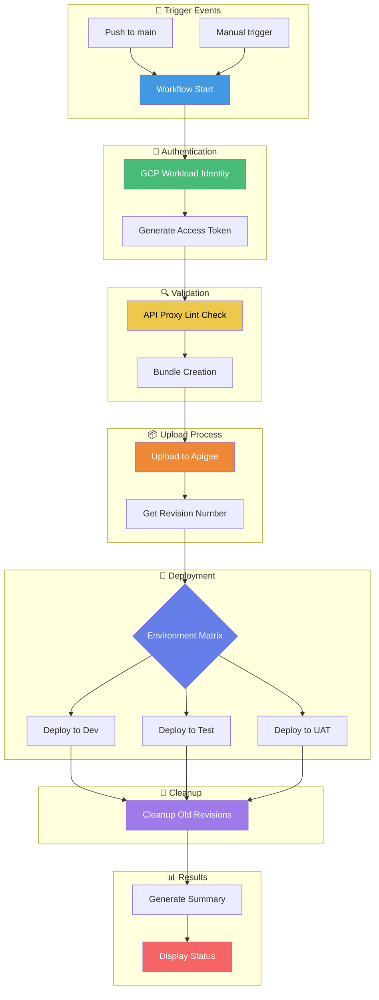
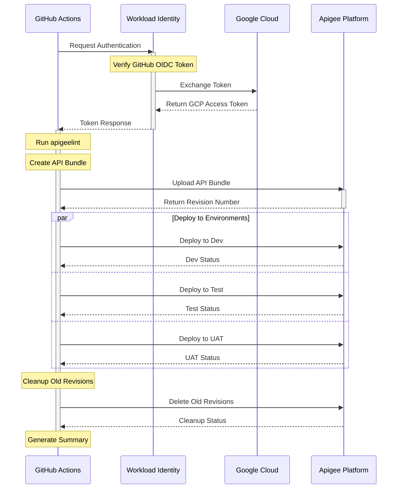
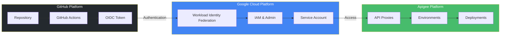

# Apigee Proxy Deployment Automation

This repository contains GitHub Actions workflows for automating Apigee API proxy deployments using Workload Identity Federation for authentication.

## 📋 Table of Contents
- [Architecture & Flow](#architecture--flow)
- [Prerequisites](#prerequisites)
- [Google Cloud Setup](#google-cloud-setup)
- [GitHub Configuration](#github-configuration)
- [Repository Structure](#repository-structure)
- [Workflow Features](#workflow-features)
- [Usage Guide](#usage-guide)
- [Troubleshooting](#troubleshooting)

## 🏗️ Architecture & Flow

### Deployment Pipeline Flow


### Component Interaction


### System Architecture


### Flow Explanation

1. **Trigger Events** 🌟
   - Push to main branch
   - Manual workflow dispatch
   - Automated schedule (if configured)

2. **Authentication** 🔐
   - GitHub OIDC token generation
   - Workload Identity Federation exchange
   - GCP service account token acquisition

3. **Validation** 🔍
   - API proxy linting with apigeelint
   - Bundle structure verification
   - Policy validation

4. **Upload Process** 📦
   - Bundle creation
   - Version management
   - Revision tracking

5. **Deployment** 🚀
   - Matrix-based environment deployment
   - Parallel deployment capability
   - Environment-specific configurations

6. **Cleanup** 🧹
   - Old revision removal
   - Keeping last N versions
   - Cleanup verification

7. **Results** 📊
   - Deployment status summary
   - Environment status report
   - Visual success/failure indicators

## 🔧 Prerequisites

- Google Cloud Project with Apigee X/hybrid enabled
- GitHub repository with Actions enabled
- GitHub organization or repository admin access
- Google Cloud CLI (gcloud) installed locally

## ☁️ Google Cloud Setup

### 1. Initial Setup
```bash
# Set your variables
export PROJECT_ID="your-project-id"
export PROJECT_NUMBER="your-project-number"
export GITHUB_ORG="your-github-org"
export POOL_NAME="github-actions"
export PROVIDER_NAME="github"
```

### 2. Create Workload Identity Pool
```bash
# Create the pool
gcloud iam workload-identity-pools create "${POOL_NAME}" \
    --project="${PROJECT_ID}" \
    --location="global" \
    --display-name="GitHub Actions Pool"

# Get the pool ID
export WORKLOAD_IDENTITY_POOL_ID=$(gcloud iam workload-identity-pools describe "${POOL_NAME}" \
    --project="${PROJECT_ID}" \
    --location="global" \
    --format="value(name)")
```

### 3. Create Workload Identity Provider
```bash
# Create the provider
gcloud iam workload-identity-pools providers create-oidc "${PROVIDER_NAME}" \
    --project="${PROJECT_ID}" \
    --location="global" \
    --workload-identity-pool="${POOL_NAME}" \
    --display-name="GitHub provider" \
    --attribute-mapping="google.subject=assertion.sub,attribute.actor=assertion.actor,attribute.repository=assertion.repository" \
    --issuer-uri="https://token.actions.githubusercontent.com"

# Get the provider resource name
export WORKLOAD_IDENTITY_PROVIDER=$(gcloud iam workload-identity-pools providers describe "${PROVIDER_NAME}" \
    --project="${PROJECT_ID}" \
    --location="global" \
    --workload-identity-pool="${POOL_NAME}" \
    --format="value(name)")
```

### 4. Create Service Account
```bash
# Create service account
export SA_NAME="apigee-deployer"
gcloud iam service-accounts create ${SA_NAME} \
    --project="${PROJECT_ID}" \
    --display-name="Apigee Deployment Service Account"

export SA_EMAIL="${SA_NAME}@${PROJECT_ID}.iam.gserviceaccount.com"

# Grant necessary roles
gcloud projects add-iam-policy-binding ${PROJECT_ID} \
    --member="serviceAccount:${SA_EMAIL}" \
    --role="roles/apigee.apiAdmin"

gcloud projects add-iam-policy-binding ${PROJECT_ID} \
    --member="serviceAccount:${SA_EMAIL}" \
    --role="roles/apigee.admin"

# Allow GitHub Actions to impersonate the service account
gcloud iam service-accounts add-iam-policy-binding "${SA_EMAIL}" \
    --project="${PROJECT_ID}" \
    --role="roles/iam.workloadIdentityUser" \
    --member="principalSet://iam.googleapis.com/${WORKLOAD_IDENTITY_POOL_ID}/attribute.repository/${GITHUB_ORG}/*"
```

## 🔒 GitHub Configuration

### 1. Organization Secrets
Set up the following secrets in your GitHub organization settings (Settings → Secrets and variables → Actions):

|
 Secret Name 
|
 Description 
|
 Value Example 
|
|
------------
|
-------------
|
---------------
|
|
`APIGEE_ORG`
|
 Your Apigee organization name 
|
`my-org`
|
|
`WORKLOAD_IDENTITY_PROVIDER`
|
 Full resource name of your Workload Identity Provider 
|
`projects/123456789/locations/global/workloadIdentityPools/github-actions/providers/github`
|
|
`SERVICE_ACCOUNT`
|
 Service account email 
|
`apigee-deployer@project-id.iam.gserviceaccount.com`
|

### 2. Repository Setup
1. Create the following directory structure in your repository:
```
your-repo/
├── .github/
│   └── workflows/
│       ├── main.yml                    # Main workflow
│       └── Reusable-proxy-deploy.yml   # Reusable workflow
├── apiproxy/                           # Your API proxy files
└── README.md
```

2. Configure branch protection rules for `main` branch:
   - Require pull request reviews
   - Require status checks to pass
   - Include administrators in restrictions

## 📁 Repository Structure

```plaintext
.
├── apiproxy/
│   ├── proxies/
│   ├── targets/
│   ├── policies/
│   └── apiproxy.xml
├── .github/
│   └── workflows/
│       ├── main.yml
│       └── Reusable-proxy-deploy.yml
└── README.md
```

## ✨ Workflow Features

- ✅ Automated authentication using Workload Identity Federation
- ✅ API proxy bundle validation (apigeelint)
- ✅ Configurable deployment environments
- ✅ Environment-specific deployments
- ✅ Automatic cleanup of old revisions
- ✅ Detailed deployment summary
- ✅ Rollback capability on failure

## 🚀 Usage Guide

### Manual Trigger
1. Go to the "Actions" tab in your repository
2. Select "Apigee Proxy Deployment"
3. Click "Run workflow"
4. Fill in the parameters:
   - Proxy Name (if different from repository name)
   - Environment Group
   - Environment Type(s)
   - Proxy Directory (if different from default)

### Automatic Trigger
The workflow automatically runs when:
- Changes are pushed to `main` branch
- Changes are made in `src/**` or `apiproxy/**` directories

## 🔍 Troubleshooting

### Common Issues

1. **Authentication Failure**
```bash
# Verify Workload Identity Provider configuration
gcloud iam workload-identity-pools providers describe "${PROVIDER_NAME}" \
    --project="${PROJECT_ID}" \
    --location="global" \
    --workload-identity-pool="${POOL_NAME}"
```

2. **Deployment Failure**
```bash
# Check service account permissions
gcloud projects get-iam-policy ${PROJECT_ID} \
    --flatten="bindings[].members" \
    --filter="bindings.members:${SA_EMAIL}" \
    --format="table(bindings.role)"
```

3. **Environment Issues**
- Verify environment names in Apigee
- Check environment access permissions
- Validate environment group configuration

### Support

For issues and questions:
1. Check existing GitHub issues
2. Create a new issue with:
   - Workflow run URL
   - Error message
   - Steps to reproduce
   - Repository configuration details
