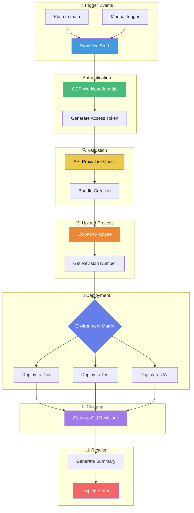
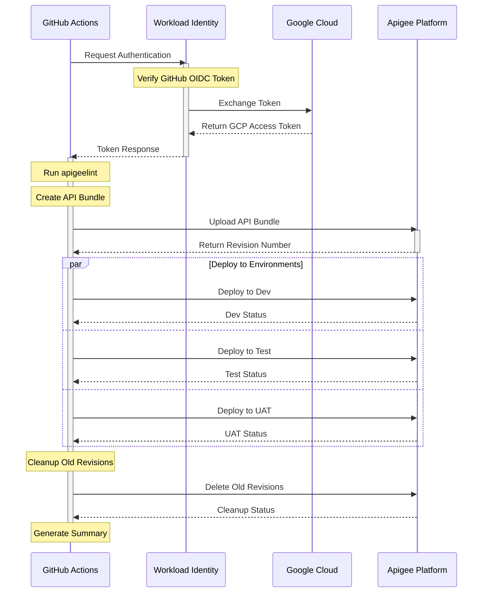
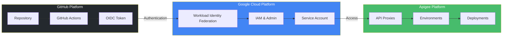

# Apigee Proxy Deployment Automation

This repository contains GitHub Actions workflows for automating Apigee API proxy deployments using Workload Identity Federation for authentication.

## 📋 Table of Contents
- [Architecture & Flow](#architecture--flow)
- [Prerequisites](#prerequisites)
- [Google Cloud Setup](#google-cloud-setup)
- [GitHub Configuration](#github-configuration)
- [Repository Structure](#repository-structure)
- [Workflow Features](#workflow-features)
- [Usage Guide](#usage-guide)
- [Troubleshooting](#troubleshooting)

## 🏗️ Architecture & Flow

### Deployment Pipeline Flow

### Component Interaction

### System Architecture

### Flow Explanation

1. **Trigger Events** 🌟
   - Push to main branch
   - Manual workflow dispatch
   - Automated schedule (if configured)

2. **Authentication** 🔐
   - GitHub OIDC token generation
   - Workload Identity Federation exchange
   - GCP service account token acquisition

3. **Validation** 🔍
   - API proxy linting with apigeelint
   - Bundle structure verification
   - Policy validation

4. **Upload Process** 📦
   - Bundle creation
   - Version management
   - Revision tracking

5. **Deployment** 🚀
   - Matrix-based environment deployment
   - Parallel deployment capability
   - Environment-specific configurations

6. **Cleanup** 🧹
   - Old revision removal
   - Keeping last N versions
   - Cleanup verification

7. **Results** 📊
   - Deployment status summary
   - Environment status report
   - Visual success/failure indicators

[Rest of the README content remains the same...]
