# 🚀 Apigee Proxy Deployment Automation

Automated deployment pipeline for Apigee API proxies using GitHub Actions and Google Cloud Workload Identity Federation.

## 📋 Table of Contents
- [Features](#features)
- [Architecture & Flow](#architecture--flow)
- [Prerequisites](#prerequisites)
- [Setup Instructions](#setup-instructions)
  - [Google Cloud Configuration](#google-cloud-configuration)
  - [GitHub Configuration](#github-configuration)
  - [Repository Setup](#repository-setup)
- [Usage Guide](#usage-guide)
- [Workflow Details](#workflow-details)
- [Security Best Practices](#security-best-practices)
- [Troubleshooting](#troubleshooting)
- [Contributing](#contributing)

## ✨ Features

- 🔐 Secure authentication using Workload Identity Federation
- 🔄 Automated deployments triggered by git pushes
- 🧪 API proxy validation using apigeelint
- 🌐 Multi-environment deployment support
- 📊 Detailed deployment summaries
- 🧹 Automatic cleanup of old revisions
- ⚡ Parallel deployment capabilities
- 🔄 Automatic rollback on failure

## 🏗️ Architecture & Flow

### Deployment Pipeline Flow

```mermaid
flowchart TB
    subgraph "🌟 Trigger Events"
        A1["Push to main"] --> T
        A2["Manual trigger"] --> T
        T["Workflow Start"]
    end

    subgraph "🔐 Authentication"
        T --> B["GCP Workload Identity"]
        B --> C["Generate Access Token"]
    end

    subgraph "🔍 Validation"
        C --> D["API Proxy Lint Check"]
        D --> E["Bundle Creation"]
    end

    subgraph "📦 Upload Process"
        E --> F["Upload to Apigee"]
        F --> G["Get Revision Number"]
    end

    subgraph "🚀 Deployment"
        G --> H{"Environment Matrix"}
        H --> I1["Deploy to Dev"]
        H --> I2["Deploy to Test"]
        H --> I3["Deploy to UAT"]
    end

    subgraph "🧹 Cleanup"
        I1 --> J["Cleanup Old Revisions"]
        I2 --> J
        I3 --> J
    end

    subgraph "📊 Results"
        J --> K["Generate Summary"]
        K --> L["Display Status"]
    end
```


## 📋 Prerequisites

1. **Google Cloud Project**
   - Apigee X/hybrid enabled
   - Owner/Admin permissions
   - Billing enabled

2. **GitHub**
   - Organization or repository admin access
   - Actions enabled
   - Branch protection rules configured

3. **Local Development**
   - Google Cloud CLI installed
   - Git installed
   - Node.js (for apigeelint)

## 🛠️ Setup Instructions

### Google Cloud Configuration

1. **Set Environment Variables**
```bash
export PROJECT_ID="your-project-id"
export PROJECT_NUMBER="your-project-number"
export GITHUB_ORG="your-github-org"
export POOL_NAME="github-actions"
export PROVIDER_NAME="github"
```

2. **Create Workload Identity Pool**
```bash
# Create pool
gcloud iam workload-identity-pools create "${POOL_NAME}" \
    --project="${PROJECT_ID}" \
    --location="global" \
    --display-name="GitHub Actions Pool"

# Get pool ID
export WORKLOAD_IDENTITY_POOL_ID=$(gcloud iam workload-identity-pools describe "${POOL_NAME}" \
    --project="${PROJECT_ID}" \
    --location="global" \
    --format="value(name)")
```

3. **Create Workload Identity Provider**
```bash
gcloud iam workload-identity-pools providers create-oidc "${PROVIDER_NAME}" \
    --project="${PROJECT_ID}" \
    --location="global" \
    --workload-identity-pool="${POOL_NAME}" \
    --display-name="GitHub provider" \
    --attribute-mapping="google.subject=assertion.sub,attribute.actor=assertion.actor,attribute.repository=assertion.repository" \
    --issuer-uri="https://token.actions.githubusercontent.com"

# Get provider name
export WORKLOAD_IDENTITY_PROVIDER=$(gcloud iam workload-identity-pools providers describe "${PROVIDER_NAME}" \
    --project="${PROJECT_ID}" \
    --location="global" \
    --workload-identity-pool="${POOL_NAME}" \
    --format="value(name)")
```

4. **Configure Service Account**
```bash
# Create service account
export SA_NAME="apigee-deployer"
gcloud iam service-accounts create ${SA_NAME} \
    --project="${PROJECT_ID}" \
    --display-name="Apigee Deployment Service Account"

export SA_EMAIL="${SA_NAME}@${PROJECT_ID}.iam.gserviceaccount.com"

# Assign roles
gcloud projects add-iam-policy-binding ${PROJECT_ID} \
    --member="serviceAccount:${SA_EMAIL}" \
    --role="roles/apigee.apiAdmin"

gcloud projects add-iam-policy-binding ${PROJECT_ID} \
    --member="serviceAccount:${SA_EMAIL}" \
    --role="roles/apigee.admin"

# Configure Workload Identity Federation
gcloud iam service-accounts add-iam-policy-binding "${SA_EMAIL}" \
    --project="${PROJECT_ID}" \
    --role="roles/iam.workloadIdentityUser" \
    --member="principalSet://iam.googleapis.com/${WORKLOAD_IDENTITY_POOL_ID}/attribute.repository/${GITHUB_ORG}/*"
```

### GitHub Configuration

1. **Organization Secrets**

Navigate to Organization Settings → Secrets and variables → Actions and add:

| Secret Name | Description | Value |
|------------|-------------|-------|
| `APIGEE_ORG` | Apigee organization name | `my-org` |
| `WORKLOAD_IDENTITY_PROVIDER` | WIF provider resource name | `projects/123.../providers/github` |
| `SERVICE_ACCOUNT` | Service account email | `apigee-deployer@project-id.iam.gserviceaccount.com` |

2. **Repository Structure**
```plaintext
your-repo/
├── .github/
│   ├── workflows/
│   │   ├── main.yml                    # Main workflow
│   │   └── Reusable-proxy-deploy.yml   # Reusable workflow
│   └── components/                      # React components for summary
├── apiproxy/                           # Your API proxy files
│   ├── proxies/
│   ├── targets/
│   ├── policies/
│   └── apiproxy.xml
└── README.md
```

## 🚀 Usage Guide

### Manual Deployment

1. Go to Actions tab in your repository
2. Select "Apigee Proxy Deployment"
3. Click "Run workflow"
4. Fill in parameters:
   ```yaml
   proxy_name: "YourProxyName"
   environment_group: "default"
   environment_type: "dev,test,uat"
   proxy_directory: "apiproxy"
   ```

### Automated Deployment

The workflow triggers automatically on:
- Push to `main` branch
- Changes in `src/**` or `apiproxy/**`

### Environment Configuration

Supported environment groups:
- `default`
- `edd`
- `homerun`
- `wow`
- `wpay`

Environment types:
- `dev`
- `test`
- `uat`

## 🔍 Workflow Details

### Main Workflow (`main.yml`)
- Handles workflow triggers
- Passes configuration to reusable workflow
- Manages secrets and inputs

### Reusable Workflow (`Reusable-proxy-deploy.yml`)
1. **Prepare Environment List**
   - Generates environment names
   - Handles group prefixing

2. **Authentication**
   - Uses Workload Identity Federation
   - Generates access tokens

3. **Validation**
   - Runs apigeelint
   - Validates proxy structure

4. **Upload Process**
   - Creates proxy bundle
   - Uploads to Apigee

5. **Deployment**
   - Matrix-based deployment
   - Environment-specific handling

6. **Cleanup**
   - Removes old revisions
   - Maintains last 5 versions

## 🔒 Security Best Practices

1. **Authentication**
   - Use Workload Identity Federation instead of service account keys
   - Implement least privilege access
   - Regular rotation of service accounts

2. **Repository Security**
   - Enable branch protection
   - Require pull request reviews
   - Enable required status checks

3. **Secrets Management**
   - Use organization-level secrets
   - Regular secret rotation
   - Audit secret access

## 🔧 Troubleshooting

### Common Issues

1. **Authentication Failures**
```bash
# Verify provider configuration
gcloud iam workload-identity-pools providers describe "${PROVIDER_NAME}" \
    --project="${PROJECT_ID}" \
    --location="global" \
    --workload-identity-pool="${POOL_NAME}"
```

2. **Deployment Failures**
```bash
# Check service account permissions
gcloud projects get-iam-policy ${PROJECT_ID} \
    --flatten="bindings[].members" \
    --filter="bindings.members:${SA_EMAIL}"
```

3. **Environment Issues**
- Verify environment existence
- Check naming conventions
- Validate access permissions

### Logs and Debugging

1. **GitHub Actions**
   - Check workflow run logs
   - Review deployment summary
   - Verify secret availability

2. **Apigee**
   - Check deployment status
   - Verify proxy revisions
   - Review environment status

## 🤝 Contributing

1. Fork the repository
2. Create a feature branch
3. Commit your changes
4. Push to the branch
5. Create a Pull Request

