# 🚀 Apigee Proxy Deployment Automation

Automated deployment pipeline for Apigee API proxies using GitHub Actions and Google Cloud Workload Identity Federation.

## 📋 Table of Contents
- [Features](#features)
- [Architecture & Flow](#architecture--flow)
- [Prerequisites](#prerequisites)
- [Setup Instructions](#setup-instructions)
  - [Google Cloud Configuration](#google-cloud-configuration)
  - [GitHub Configuration](#github-configuration)
  - [Repository Setup](#repository-setup)
- [Usage Guide](#usage-guide)
- [Workflow Details](#workflow-details)
- [Security Best Practices](#security-best-practices)
- [Troubleshooting](#troubleshooting)
- [Contributing](#contributing)

## ✨ Features

- 🔐 Secure authentication using Workload Identity Federation
- 🔄 Automated deployments triggered by git pushes
- 🧪 API proxy validation using apigeelint
- 🌐 Multi-environment deployment support
- 📊 Detailed deployment summaries
- 🧹 Automatic cleanup of old revisions
- ⚡ Parallel deployment capabilities
- 🔄 Automatic rollback on failure

## 🏗️ Architecture & Flow

### Deployment Pipeline Flow

```mermaid
flowchart TB
    subgraph "🌟 Trigger Events"
        A1["Push to main"] --> T
        A2["Manual trigger"] --> T
        T["Workflow Start"]
    end

    subgraph "🔐 Authentication"
        T --> B["GCP Workload Identity"]
        B --> C["Generate Access Token"]
    end

    subgraph "🔍 Validation"
        C --> D["API Proxy Lint Check"]
        D --> E["Bundle Creation"]
    end

    subgraph "📦 Upload Process"
        E --> F["Upload to Apigee"]
        F --> G["Get Revision Number"]
    end

    subgraph "🚀 Deployment"
        G --> H{"Environment Matrix"}
        H --> I1["Deploy to Dev"]
        H --> I2["Deploy to Test"]
        H --> I3["Deploy to UAT"]
    end

    subgraph "🧹 Cleanup"
        I1 --> J["Cleanup Old Revisions"]
        I2 --> J
        I3 --> J
    end

    subgraph "📊 Results"
        J --> K["Generate Summary"]
        K --> L["Display Status"]
    end
```


## 📋 Prerequisites

1. **Google Cloud Project**
   - Apigee X/hybrid enabled
   - Owner/Admin permissions
   - Billing enabled

2. **GitHub**
   - Organization or repository admin access
   - Actions enabled
   - Branch protection rules configured

3. **Local Development**
   - Google Cloud CLI installed
   - Git installed
   - Node.js (for apigeelint)

## 🛠️ Setup Instructions

### Google Cloud Configuration

1. **Set Environment Variables**
```bash
export PROJECT_ID="your-project-id"
export PROJECT_NUMBER="your-project-number"
export GITHUB_ORG="your-github-org"
export POOL_NAME="github-actions"
export PROVIDER_NAME="github"
```

2. **Create Workload Identity Pool**
```bash
# Create pool
gcloud iam workload-identity-pools create "${POOL_NAME}" \
    --project="${PROJECT_ID}" \
    --location="global" \
    --display-name="GitHub Actions Pool"

# Get pool ID
export WORKLOAD_IDENTITY_POOL_ID=$(gcloud iam workload-identity-pools describe "${POOL_NAME}" \
    --project="${PROJECT_ID}" \
    --location="global" \
    --format="value(name)")
```

3. **Create Workload Identity Provider**
```bash
gcloud iam workload-identity-pools providers create-oidc "${PROVIDER_NAME}" \
    --project="${PROJECT_ID}" \
    --location="global" \
    --workload-identity-pool="${POOL_NAME}" \
    --display-name="GitHub provider" \
    --attribute-mapping="google.subject=assertion.sub,attribute.actor=assertion.actor,attribute.repository=assertion.repository" \
    --issuer-uri="https://token.actions.githubusercontent.com"

# Get provider name
export WORKLOAD_IDENTITY_PROVIDER=$(gcloud iam workload-identity-pools providers describe "${PROVIDER_NAME}" \
    --project="${PROJECT_ID}" \
    --location="global" \
    --workload-identity-pool="${POOL_NAME}" \
    --format="value(name)")
```

4. **Configure Service Account**
```bash
# Create service account
export SA_NAME="apigee-deployer"
gcloud iam service-accounts create ${SA_NAME} \
    --project="${PROJECT_ID}" \
    --display-name="Apigee Deployment Service Account"

export SA_EMAIL="${SA_NAME}@${PROJECT_ID}.iam.gserviceaccount.com"

# Assign roles
gcloud projects add-iam-policy-binding ${PROJECT_ID} \
    --member="serviceAccount:${SA_EMAIL}" \
    --role="roles/apigee.apiAdmin"

gcloud projects add-iam-policy-binding ${PROJECT_ID} \
    --member="serviceAccount:${SA_EMAIL}" \
    --role="roles/apigee.admin"

# Configure Workload Identity Federation
gcloud iam service-accounts add-iam-policy-binding "${SA_EMAIL}" \
    --project="${PROJECT_ID}" \
    --role="roles/iam.workloadIdentityUser" \
    --member="principalSet://iam.googleapis.com/${WORKLOAD_IDENTITY_POOL_ID}/attribute.repository/${GITHUB_ORG}/*"
```

### GitHub Configuration

1. **Organization Secrets**

Navigate to Organization Settings → Secrets and variables → Actions and add:

| Secret Name | Description | Value |
|------------|-------------|-------|
| `APIGEE_ORG` | Apigee organization name | `my-org` |
| `WORKLOAD_IDENTITY_PROVIDER` | WIF provider resource name | `projects/123.../providers/github` |
| `SERVICE_ACCOUNT` | Service account email | `apigee-deployer@project-id.iam.gserviceaccount.com` |

[Previous sections of README remain the same until Repository Structure]

## 📁 Repository Structure & Code

### Repository Structure
```plaintext
your-repo/
├── .github/
│   └── workflows/
│       └── Reusable-proxy-deploy.yml   # Reusable workflow
├── apiproxy/                           # Your API proxy files
│   ├── proxies/
│   ├── targets/
│   ├── policies/
│   └── apiproxy.xml
└── README.md
```

## 📝 Detailed Implementation Guide

### Reusable Workflow Structure
The workflow is designed to be reusable across different repositories with standardized inputs and secrets.

#### 1. Workflow Trigger Configuration
```yaml
name: Apigee Proxy Deployment [Reusable Workflow]

on:
  workflow_call:
    inputs:
      proxy_name:
        description: The name of the API proxy to deploy
        required: true
        type: string
      proxy_directory:
        description: Working directory to zip up as your proxy bundle
        required: false
        type: string
        default: 'apiproxy'
      environment_group:
        description: The environment group to deploy to
        required: true
        type: string
      environment_type:
        description: The environment types to deploy to
        required: true
        type: string
      runner:
        description: The runner to use for the job
        required: false
        default: 'ubuntu-latest'
        type: string
    secrets:
      apigee_org:
        required: true
      workload_identity_provider:
        required: true
      service_account:
        required: true
```

**Explanation:**
- `workflow_call`: Enables the workflow to be called from other workflows
- `inputs`: Configurable parameters that can be passed to the workflow
  - `proxy_name`: Name of the API proxy to be deployed
  - `proxy_directory`: Location of the API proxy files
  - `environment_group`: Target environment group (e.g., default, edd)
  - `environment_type`: Target environment types (e.g., dev, test, uat)
- `secrets`: Required secrets for authentication and deployment
  - `apigee_org`: Apigee organization identifier
  - `workload_identity_provider`: GCP Workload Identity Provider path
  - `service_account`: Service account email for authentication

#### 2. Environment List Preparation
```yaml
Prepare_Environment_List:
    runs-on: ${{ inputs.runner }}
    outputs:
      environments: ${{ steps.set-envs.outputs.environments }}
    steps:
      - name: Set Environment List
        id: set-envs
        run: |
          GROUP="${{ inputs.environment_group }}"
          TYPES="${{ inputs.environment_type }}"
          
          generate_env_list() {
            local group=$1
            local types=$2
            local envs="["
            
            IFS=',' read -ra ENV_TYPES <<< "$types"
            local first=true
            
            for type in "${ENV_TYPES[@]}"; do
              if [ "$first" = true ]; then
                first=false
              else
                envs="${envs},"
              fi
              
              if [ "$group" = "default" ]; then
                envs="${envs}\"${type}\""
              else
                envs="${envs}\"${group}-${type}\""
              fi
            done
            
            envs="${envs}]"
            echo "$envs"
          }
          
          ENVIRONMENTS=$(generate_env_list "$GROUP" "$TYPES")
          echo "environments=$ENVIRONMENTS" >> $GITHUB_OUTPUT
```

**Explanation:**
- **Purpose**: Creates a JSON array of environment names based on group and type
- **Function Breakdown**:
  - Takes environment group and types as input
  - Splits comma-separated environment types
  - Handles default group differently (no prefix)
  - Creates properly formatted JSON array
- **Output**: JSON array like `["dev","test","uat"]` or `["edd-dev","edd-test"]`

#### 3. GCP Authentication
```yaml
GCP_Auth:
    needs: [Prepare_Environment_List]
    runs-on: ${{ inputs.runner }}
    outputs:
      access_token: ${{ steps.auth.outputs.access_token }}
    steps:
      - name: Checkout code
        uses: actions/checkout@v4

      - name: Authenticate to Google Cloud
        id: auth
        uses: 'google-github-actions/auth@v1'
        with:
          workload_identity_provider: ${{ secrets.workload_identity_provider }}
          service_account: ${{ secrets.service_account }}
          token_format: 'access_token'
          create_credentials_file: true

      - name: Set up Cloud SDK
        uses: google-github-actions/setup-gcloud@v1

      - name: Get and Store Access Token
        run: |
          TOKEN=$(gcloud auth print-access-token)
          echo "::add-mask::$TOKEN"
          echo "access_token=$TOKEN" >> $GITHUB_OUTPUT
```

**Explanation:**
- **Purpose**: Securely authenticates with Google Cloud using Workload Identity Federation
- **Steps**:
  1. Checkout code to ensure workspace is available
  2. Authenticate using google-github-actions/auth
  3. Set up Google Cloud SDK
  4. Generate and store access token securely
- **Security Features**:
  - Token masking in logs
  - Workload Identity Federation instead of service account keys
  - Temporary token generation

#### 4. API Proxy Linting
```yaml
ApigeeLint:
    needs: [GCP_Auth]
    runs-on: ${{ inputs.runner }}
    steps:
      - name: Checkout code
        uses: actions/checkout@v4

      - name: Setup Node.js
        uses: actions/setup-node@v3
        with:
          node-version: '20'

      - name: Install apigeelint
        run: npm install -g apigeelint

      - name: Run apigeelint
        run: apigeelint -s ${{ inputs.proxy_directory }} -f table.js
```

**Explanation:**
- **Purpose**: Validates API proxy structure and policies
- **Steps**:
  1. Sets up Node.js environment
  2. Installs apigeelint globally
  3. Runs linting on proxy directory
- **Validation Checks**:
  - Policy structure
  - Best practices
  - Security configurations
  - Performance considerations

#### 5. Bundle Preparation and Upload
```yaml
Prepare_and_Upload:
    needs: [GCP_Auth, ApigeeLint]
    runs-on: ${{ inputs.runner }}
    outputs:
      latest_revision: ${{ steps.upload.outputs.revision }}
    steps:
      - name: Checkout code
        uses: actions/checkout@v4

      - name: Install apigeecli
        run: |
          mkdir -p $HOME/.apigeecli/bin
          curl -L https://raw.githubusercontent.com/apigee/apigeecli/main/downloadLatest.sh | sh -
          echo "$HOME/.apigeecli/bin" >> $GITHUB_PATH

      - name: Create API bundle
        run: |
          create_bundle() {
            local source_dir="$1"
            echo "Creating bundle from: $source_dir"
            mkdir -p temp_bundle
            cp -r "$source_dir" temp_bundle/apiproxy
            cd temp_bundle
            zip -r ../proxy.zip apiproxy
            cd ..
            echo "Zip contents:"
            unzip -l proxy.zip
            rm -rf temp_bundle
          }
          
          if [ -d "${{ inputs.proxy_directory }}" ]; then
            create_bundle "${{ inputs.proxy_directory }}"
          elif [ -d "src/${{ inputs.proxy_directory }}" ]; then
            create_bundle "src/${{ inputs.proxy_directory }}"
          else
            echo "Error: Could not find apiproxy directory"
            exit 1
          fi

      - name: Upload and Get Revision
        id: upload
        run: |
          echo "Importing API proxy bundle to Apigee organization"
          TOKEN="${{ needs.GCP_Auth.outputs.access_token }}"
          
          IMPORT_OUTPUT=$($HOME/.apigeecli/bin/apigeecli apis create bundle \
            -n "${{ inputs.proxy_name }}" \
            -p proxy.zip \
            --org "${{ secrets.apigee_org }}" \
            --token "$TOKEN")
          
          echo "$IMPORT_OUTPUT"
          REVISION=$(echo "$IMPORT_OUTPUT" | grep -oP 'revision.*?(\d+)' | grep -oP '\d+')
          echo "revision=$REVISION" >> $GITHUB_OUTPUT
```

**Explanation:**
- **Purpose**: Creates and uploads API proxy bundle to Apigee
- **Key Functions**:
  1. **Bundle Creation**:
     - Creates temporary directory
     - Copies proxy files
     - Creates zip archive
     - Validates zip contents
  2. **Upload Process**:
     - Uses apigeecli for upload
     - Extracts revision number
     - Handles error cases
- **Output**: New revision number for deployment

#### 6. Environment Deployment
```yaml
Deploy_to_Environment:
    needs: [Prepare_Environment_List, GCP_Auth, Prepare_and_Upload]
    strategy:
      matrix:
        environment: ${{ fromJSON(needs.Prepare_Environment_List.outputs.environments) }}
      fail-fast: false
      max-parallel: 1
    runs-on: ${{ inputs.runner }}
    environment: ${{ matrix.environment }}
    steps:
      - name: Install apigeecli
        run: |
          mkdir -p $HOME/.apigeecli/bin
          curl -L https://raw.githubusercontent.com/apigee/apigeecli/main/downloadLatest.sh | sh -
          echo "$HOME/.apigeecli/bin" >> $GITHUB_PATH

      - name: Deploy to Environment
        env:
          APIGEE_ORG: ${{ secrets.apigee_org }}
          APIGEE_ENV: ${{ matrix.environment }}
          PROXY_NAME: ${{ inputs.proxy_name }}
          ACCESS_TOKEN: ${{ needs.GCP_Auth.outputs.access_token }}
          LATEST_REVISION: ${{ needs.Prepare_and_Upload.outputs.latest_revision }}
        run: |
          if [ -z "$LATEST_REVISION" ]; then
            echo "Error: LATEST_REVISION is empty. Deployment cannot proceed."
            exit 1
          fi
          
          echo "Deploying proxy '$PROXY_NAME' revision '$LATEST_REVISION' to environment '$APIGEE_ENV'"
          
          $HOME/.apigeecli/bin/apigeecli apis deploy \
            --name "$PROXY_NAME" \
            --org "$APIGEE_ORG" \
            --env "$APIGEE_ENV" \
            --rev "$LATEST_REVISION" \
            --token "$ACCESS_TOKEN" \
            --ovr \
            --wait
```

**Explanation:**
- **Purpose**: Deploys API proxy to specified environments
- **Strategy**:
  - Matrix-based deployment
  - Sequential execution (max-parallel: 1)
  - Independent environment handling
- **Features**:
  - Overrides existing deployments
  - Waits for deployment completion
  - Error handling and validation

 #### 7. Cleanup and Revision Management
```yaml
Cleanup_Old_Revisions:
    needs: [Deploy_to_Environment]
    if: always()
    runs-on: ${{ inputs.runner }}
    steps:
      - name: Delete Older Revisions
        env:
          APIGEE_ORG: ${{ secrets.apigee_org }}
          APIGEE_PROXY_NAME: ${{ inputs.proxy_name }}
          ACCESS_TOKEN: ${{ needs.GCP_Auth.outputs.access_token }}
        run: |
          REVISIONS=$(curl -s -H "Authorization: Bearer $ACCESS_TOKEN" \
            "https://apigee.googleapis.com/v1/organizations/$APIGEE_ORG/apis/$APIGEE_PROXY_NAME/revisions")
          
          readarray -t REVISIONS < <(echo "$REVISIONS" | jq -r '.[]' | sort -n)
          TOTAL_REVISIONS=${#REVISIONS[@]}
          KEEP_COUNT=5
          
          if [ "$TOTAL_REVISIONS" -gt "$KEEP_COUNT" ]; then
            DELETE_COUNT=$((TOTAL_REVISIONS - KEEP_COUNT))
            for ((i=0; i<DELETE_COUNT; i++)); do
              REV="${REVISIONS[$i]}"
              curl -X DELETE -H "Authorization: Bearer $ACCESS_TOKEN" \
                "https://apigee.googleapis.com/v1/organizations/$APIGEE_ORG/apis/$APIGEE_PROXY_NAME/revisions/$REV"
            done
          fi
```

**Explanation:**
- **Purpose**: Manages API proxy revisions by cleaning up old versions
- **Process**:
  1. Fetches all revisions
  2. Sorts numerically
  3. Keeps latest 5 revisions
  4. Deletes older revisions
- **Features**:
  - Runs even if deployment fails
  - Maintains revision history
  - Prevents accumulation of old revisions

#### 8. Deployment Summary
```yaml
Deployment_Summary:
    needs: [ApigeeLint, Prepare_and_Upload, Deploy_to_Environment, Prepare_Environment_List, Cleanup_Old_Revisions]
    if: always()
    runs-on: ${{ inputs.runner }}
    steps:
      - name: Generate Deployment Summary
        env:
          LINT_RESULT: ${{ needs.ApigeeLint.result }}
          DEPLOY_RESULT: ${{ needs.Deploy_to_Environment.result }}
          PROXY_NAME: ${{ inputs.proxy_name }}
          NEW_VERSION: ${{ needs.Prepare_and_Upload.outputs.latest_revision }}
          ENVIRONMENTS: ${{ needs.Prepare_Environment_List.outputs.environments }}
          GROUP: ${{ inputs.environment_group }}
          TYPES: ${{ inputs.environment_type }}
        run: |
          {
            echo "# 🚀 Apigee Proxy Deployment Summary"
            echo
            echo "## 📊 Deployment Information"
            echo "| Item | Value |"
            echo "|------|-------|"
            echo "| Proxy Name | ${PROXY_NAME} |"
            echo "| New Version | ${NEW_VERSION} |"
            echo "| Environment Group | ${GROUP} |"
            echo "| Environment Types | ${TYPES} |"
            echo "| Target Environments | ${ENVIRONMENTS} |"
            echo
            echo "## 📋 Status"
            echo "| Step | Result |"
            echo "|------|--------|"
            if [ "$LINT_RESULT" == "success" ]; then
              echo "| Lint Check | ✅ Success |"
            else
              echo "| Lint Check | ❌ Failed |"
            fi
            if [ "$DEPLOY_RESULT" == "success" ]; then
              echo "| Deployment | ✅ Success |"
            else
              echo "| Deployment | ❌ Failed |"
            fi
          } >> $GITHUB_STEP_SUMMARY
```

**Explanation:**
- **Purpose**: Generates a comprehensive deployment report
- **Included Information**:
  - Proxy details
  - Environment information
  - Step-by-step results
  - Success/failure indicators
- **Features**:
  - Markdown formatting
  - Emoji indicators
  - Clear status representation

### Usage Examples

#### 1. Basic Deployment
```yaml
jobs:
  deploy:
    uses: ./.github/workflows/Reusable-proxy-deploy.yml
    with:
      proxy_name: "WeatherForecastAPI"
      environment_group: "default"
      environment_type: "dev,test"
      proxy_directory: "apiproxy

## 🔧 Troubleshooting

### Common Issues

1. **Authentication Failures**
```bash
# Verify provider configuration
gcloud iam workload-identity-pools providers describe "${PROVIDER_NAME}" \
    --project="${PROJECT_ID}" \
    --location="global" \
    --workload-identity-pool="${POOL_NAME}"
```

2. **Deployment Failures**
```bash
# Check service account permissions
gcloud projects get-iam-policy ${PROJECT_ID} \
    --flatten="bindings[].members" \
    --filter="bindings.members:${SA_EMAIL}"
```

3. **Environment Issues**
- Verify environment existence
- Check naming conventions
- Validate access permissions

### Logs and Debugging

1. **GitHub Actions**
   - Check workflow run logs
   - Review deployment summary
   - Verify secret availability

2. **Apigee**
   - Check deployment status
   - Verify proxy revisions
   - Review environment status

## 🤝 Contributing

1. Fork the repository
2. Create a feature branch
3. Commit your changes
4. Push to the branch
5. Create a Pull Request

