# 🚀 Apigee Proxy Deployment Automation

Automated deployment pipeline for Apigee API proxies using GitHub Actions and Google Cloud Workload Identity Federation.

## 📋 Table of Contents
- [Features](#features)
- [Architecture & Flow](#architecture--flow)
- [Prerequisites](#prerequisites)
- [Setup Instructions](#setup-instructions)
  - [Google Cloud Configuration](#google-cloud-configuration)
  - [GitHub Configuration](#github-configuration)
  - [Repository Setup](#repository-setup)
- [Usage Guide](#usage-guide)
- [Workflow Details](#workflow-details)
- [Security Best Practices](#security-best-practices)
- [Troubleshooting](#troubleshooting)
- [Contributing](#contributing)

## ✨ Features

- 🔐 Secure authentication using Workload Identity Federation
- 🔄 Automated deployments triggered by git pushes
- 🧪 API proxy validation using apigeelint
- 🌐 Multi-environment deployment support
- 📊 Detailed deployment summaries
- 🧹 Automatic cleanup of old revisions
- ⚡ Parallel deployment capabilities
- 🔄 Automatic rollback on failure

## 🏗️ Architecture & Flow

### Deployment Pipeline Flow

```mermaid
flowchart TB
    subgraph "🌟 Trigger Events"
        A1["Push to main"] --> T
        A2["Manual trigger"] --> T
        T["Workflow Start"]
    end

    subgraph "🔐 Authentication"
        T --> B["GCP Workload Identity"]
        B --> C["Generate Access Token"]
    end

    subgraph "🔍 Validation"
        C --> D["API Proxy Lint Check"]
        D --> E["Bundle Creation"]
    end

    subgraph "📦 Upload Process"
        E --> F["Upload to Apigee"]
        F --> G["Get Revision Number"]
    end

    subgraph "🚀 Deployment"
        G --> H{"Environment Matrix"}
        H --> I1["Deploy to Dev"]
        H --> I2["Deploy to Test"]
        H --> I3["Deploy to UAT"]
    end

    subgraph "🧹 Cleanup"
        I1 --> J["Cleanup Old Revisions"]
        I2 --> J
        I3 --> J
    end

    subgraph "📊 Results"
        J --> K["Generate Summary"]
        K --> L["Display Status"]
    end
```


## 📋 Prerequisites

1. **Google Cloud Project**
   - Apigee X/hybrid enabled
   - Owner/Admin permissions
   - Billing enabled

2. **GitHub**
   - Organization or repository admin access
   - Actions enabled
   - Branch protection rules configured

3. **Local Development**
   - Google Cloud CLI installed
   - Git installed
   - Node.js (for apigeelint)

## 🛠️ Setup Instructions

### Google Cloud Configuration

1. **Set Environment Variables**
```bash
export PROJECT_ID="your-project-id"
export PROJECT_NUMBER="your-project-number"
export GITHUB_ORG="your-github-org"
export POOL_NAME="github-actions"
export PROVIDER_NAME="github"
```

2. **Create Workload Identity Pool**
```bash
# Create pool
gcloud iam workload-identity-pools create "${POOL_NAME}" \
    --project="${PROJECT_ID}" \
    --location="global" \
    --display-name="GitHub Actions Pool"

# Get pool ID
export WORKLOAD_IDENTITY_POOL_ID=$(gcloud iam workload-identity-pools describe "${POOL_NAME}" \
    --project="${PROJECT_ID}" \
    --location="global" \
    --format="value(name)")
```

3. **Create Workload Identity Provider**
```bash
gcloud iam workload-identity-pools providers create-oidc "${PROVIDER_NAME}" \
    --project="${PROJECT_ID}" \
    --location="global" \
    --workload-identity-pool="${POOL_NAME}" \
    --display-name="GitHub provider" \
    --attribute-mapping="google.subject=assertion.sub,attribute.actor=assertion.actor,attribute.repository=assertion.repository" \
    --issuer-uri="https://token.actions.githubusercontent.com"

# Get provider name
export WORKLOAD_IDENTITY_PROVIDER=$(gcloud iam workload-identity-pools providers describe "${PROVIDER_NAME}" \
    --project="${PROJECT_ID}" \
    --location="global" \
    --workload-identity-pool="${POOL_NAME}" \
    --format="value(name)")
```

4. **Configure Service Account**
```bash
# Create service account
export SA_NAME="apigee-deployer"
gcloud iam service-accounts create ${SA_NAME} \
    --project="${PROJECT_ID}" \
    --display-name="Apigee Deployment Service Account"

export SA_EMAIL="${SA_NAME}@${PROJECT_ID}.iam.gserviceaccount.com"

# Assign roles
gcloud projects add-iam-policy-binding ${PROJECT_ID} \
    --member="serviceAccount:${SA_EMAIL}" \
    --role="roles/apigee.apiAdmin"

gcloud projects add-iam-policy-binding ${PROJECT_ID} \
    --member="serviceAccount:${SA_EMAIL}" \
    --role="roles/apigee.admin"

# Configure Workload Identity Federation
gcloud iam service-accounts add-iam-policy-binding "${SA_EMAIL}" \
    --project="${PROJECT_ID}" \
    --role="roles/iam.workloadIdentityUser" \
    --member="principalSet://iam.googleapis.com/${WORKLOAD_IDENTITY_POOL_ID}/attribute.repository/${GITHUB_ORG}/*"
```

### GitHub Configuration

1. **Organization Secrets**

Navigate to Organization Settings → Secrets and variables → Actions and add:

| Secret Name | Description | Value |
|------------|-------------|-------|
| `APIGEE_ORG` | Apigee organization name | `my-org` |
| `WORKLOAD_IDENTITY_PROVIDER` | WIF provider resource name | `projects/123.../providers/github` |
| `SERVICE_ACCOUNT` | Service account email | `apigee-deployer@project-id.iam.gserviceaccount.com` |

[Previous sections of README remain the same until Repository Structure]

## 📁 Repository Structure & Code

### Repository Structure
```plaintext
your-repo/
├── .github/
│   └── workflows/
│       └── Reusable-proxy-deploy.yml   # Reusable workflow
├── apiproxy/                           # Your API proxy files
│   ├── proxies/
│   ├── targets/
│   ├── policies/
│   └── apiproxy.xml
└── README.md
```

### Reusable Workflow Implementation

#### Workflow Call Configuration
```yaml
on:
  workflow_call:
    inputs:
      proxy_name:
        description: The name of the API proxy to deploy
        required: true
        type: string
      proxy_directory:
        description: Working directory to zip up as your proxy bundle
        required: false
        type: string
        default: 'apiproxy'
      environment_group:
        description: The environment group to deploy to
        required: true
        type: string
      environment_type:
        description: The environment types to deploy to
        required: true
        type: string
      runner:
        description: The runner to use for the job
        required: false
        default: 'ubuntu-latest'
        type: string
    secrets:
      apigee_org:
        required: true
      workload_identity_provider:
        required: true
      service_account:
        required: true
```

#### Key Jobs and Their Functions

1. **Environment List Preparation**
```yaml
Prepare_Environment_List:
    runs-on: ${{ inputs.runner }}
    outputs:
      environments: ${{ steps.set-envs.outputs.environments }}
    steps:
      - name: Set Environment List
        id: set-envs
        run: |
          GROUP="${{ inputs.environment_group }}"
          TYPES="${{ inputs.environment_type }}"
          
          # Environment list generation function
          generate_env_list() {
            local group=$1
            local types=$2
            local envs="["
            
            IFS=',' read -ra ENV_TYPES <<< "$types"
            local first=true
            
            for type in "${ENV_TYPES[@]}"; do
              if [ "$first" = true ]; then
                first=false
              else
                envs="${envs},"
              fi
              
              if [ "$group" = "default" ]; then
                envs="${envs}\"${type}\""
              else
                envs="${envs}\"${group}-${type}\""
              fi
            done
            
            envs="${envs}]"
            echo "$envs"
          }
          
          ENVIRONMENTS=$(generate_env_list "$GROUP" "$TYPES")
          echo "environments=$ENVIRONMENTS" >> $GITHUB_OUTPUT
```

2. **GCP Authentication**
```yaml
GCP_Auth:
    needs: [Prepare_Environment_List]
    runs-on: ${{ inputs.runner }}
    outputs:
      access_token: ${{ steps.auth.outputs.access_token }}
    steps:
      - name: Authenticate to Google Cloud
        id: auth
        uses: 'google-github-actions/auth@v1'
        with:
          workload_identity_provider: ${{ secrets.workload_identity_provider }}
          service_account: ${{ secrets.service_account }}
          token_format: 'access_token'
```

3. **API Proxy Bundle Creation and Upload**
```yaml
Prepare_and_Upload:
    needs: [GCP_Auth, ApigeeLint]
    runs-on: ${{ inputs.runner }}
    outputs:
      latest_revision: ${{ steps.upload.outputs.revision }}
    steps:
      - name: Create API bundle
        run: |
          if [ -d "${{ inputs.proxy_directory }}" ]; then
            zip -r proxy.zip ${{ inputs.proxy_directory }}/*
          else
            echo "Error: Could not find ${{ inputs.proxy_directory }} directory"
            exit 1
          fi

      - name: Upload and Get Revision
        env:
          APIGEE_ORG: ${{ secrets.apigee_org }}
          PROXY_NAME: ${{ inputs.proxy_name }}
          ACCESS_TOKEN: ${{ steps.auth.outputs.access_token }}
        run: |
          # Upload using apigeecli
          IMPORT_OUTPUT=$($HOME/.apigeecli/bin/apigeecli apis create bundle \
            -n "$PROXY_NAME" \
            -p proxy.zip \
            --org "$APIGEE_ORG" \
            --token "$ACCESS_TOKEN")
```

4. **Environment Deployment**
```yaml
Deploy_to_Environment:
    needs: [Prepare_Environment_List, GCP_Auth, Prepare_and_Upload]
    strategy:
      matrix:
        environment: ${{ fromJSON(needs.Prepare_Environment_List.outputs.environments) }}
      fail-fast: false
      max-parallel: 1
    runs-on: ${{ inputs.runner }}
    environment: ${{ matrix.environment }}
    steps:
      - name: Deploy to Environment
        env:
          APIGEE_ORG: ${{ secrets.apigee_org }}
          APIGEE_ENV: ${{ matrix.environment }}
          PROXY_NAME: ${{ inputs.proxy_name }}
          ACCESS_TOKEN: ${{ needs.GCP_Auth.outputs.access_token }}
          LATEST_REVISION: ${{ needs.Prepare_and_Upload.outputs.latest_revision }}
        run: |
          $HOME/.apigeecli/bin/apigeecli apis deploy \
            --name "$PROXY_NAME" \
            --org "$APIGEE_ORG" \
            --env "$APIGEE_ENV" \
            --rev "$LATEST_REVISION" \
            --token "$ACCESS_TOKEN" \
            --ovr \
            --wait
```

### Deployment Summary Output
The workflow generates a visual deployment summary showing:
- Authentication status
- Linting results
- Upload confirmation
- Environment-specific deployment status
- Overall deployment success/failure

### Usage Example
To use this reusable workflow:

1. **Required Organization Secrets:**
```yaml
APIGEE_ORG: "your-org-name"
WORKLOAD_IDENTITY_PROVIDER: "projects/123.../providers/github"
SERVICE_ACCOUNT: "service-account@project.iam.gserviceaccount.com"
```

2. **Environment Configuration:**
```yaml
environment_group: "default"  # or edd, homerun, wow, wpay
environment_type: "dev,test,uat"  # comma-separated values
```

3. **Input Parameters:**
```yaml
proxy_name: "WeatherForecastAPI"
proxy_directory: "apiproxy"
runner: "ubuntu-latest"
```


## 🔧 Troubleshooting

### Common Issues

1. **Authentication Failures**
```bash
# Verify provider configuration
gcloud iam workload-identity-pools providers describe "${PROVIDER_NAME}" \
    --project="${PROJECT_ID}" \
    --location="global" \
    --workload-identity-pool="${POOL_NAME}"
```

2. **Deployment Failures**
```bash
# Check service account permissions
gcloud projects get-iam-policy ${PROJECT_ID} \
    --flatten="bindings[].members" \
    --filter="bindings.members:${SA_EMAIL}"
```

3. **Environment Issues**
- Verify environment existence
- Check naming conventions
- Validate access permissions

### Logs and Debugging

1. **GitHub Actions**
   - Check workflow run logs
   - Review deployment summary
   - Verify secret availability

2. **Apigee**
   - Check deployment status
   - Verify proxy revisions
   - Review environment status

## 🤝 Contributing

1. Fork the repository
2. Create a feature branch
3. Commit your changes
4. Push to the branch
5. Create a Pull Request

