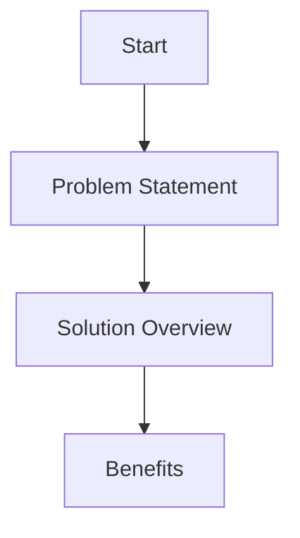
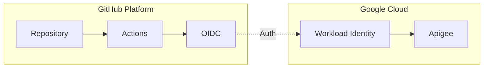

# 🎥 Apigee Proxy Deployment - Video Tutorial Production Guide

## 📋 Table of Contents
- [Project Overview](#project-overview)
- [Directory Structure](#directory-structure)
- [Tools and Requirements](#tools-and-requirements)
- [Video Content Structure](#video-content-structure)
- [Production Guide](#production-guide)
- [Scripts and Resources](#scripts-and-resources)
- [Post-Production](#post-production)

## 🎯 Project Overview

### Duration: 30 minutes
A comprehensive tutorial covering Apigee Proxy deployment automation using GitHub Actions and Google Cloud Platform.

### Target Audience
- DevOps Engineers
- API Developers
- Cloud Engineers
- CI/CD Specialists

## 📁 Directory Structure
```plaintext
video-tutorial/
├── scripts/
│   ├── main-script.md           # Complete narration script
│   └── section-scripts/         # Individual section scripts
├── assets/
│   ├── diagrams/               # All mermaid diagrams
│   ├── animations/             # Motion graphics
│   ├── code-snippets/         # Formatted code examples
│   └── transitions/           # Transition effects
├── audio/
│   ├── music/                 # Background music
│   └── voiceover/            # Recorded narration
└── production/
    ├── sections/             # Individual video sections
    └── final/               # Final rendered video
```

## 🛠️ Tools and Requirements

### Required Software
1. **Screen Recording**
   - OBS Studio (https://obsproject.com/)
   - Recommended Settings:
     ```plaintext
     Resolution: 1920x1080
     Framerate: 60fps
     Audio: 48kHz
     Recording Format: mkv
     Encoder: x264
     Rate Control: CRF
     CRF Value: 18
     ```

2. **Video Editing**
   - DaVinci Resolve
   - Download: https://www.blackmagicdesign.com/products/davinciresolve/

3. **Audio Recording**
   - Audacity
   - Settings:
     ```plaintext
     Sample Rate: 48kHz
     Bit Depth: 24-bit
     Format: WAV
     Noise Reduction: Enabled
     ```

4. **Development Environment**
   - Visual Studio Code
   - Settings:
     ```json
     {
       "editor.fontSize": 16,
       "editor.fontFamily": "Fira Code",
       "editor.lineHeight": 1.5,
       "workbench.colorTheme": "One Dark Pro",
       "editor.renderWhitespace": "none",
       "editor.minimap.enabled": false
     }
     ```

## 📝 Video Content Structure

### 1. Introduction (2 minutes)
- Problem statement
- Solution overview
- Benefits


### 2. Architecture Overview (3 minutes)
- System components
- Authentication flow
- Deployment pipeline


### 3. Implementation Steps (15 minutes)
- GCP Setup
- GitHub Configuration
- Workflow Implementation
- Deployment Process

### 4. Live Demo (8 minutes)
- Real-time deployment
- Results verification
- Troubleshooting tips

### 5. Conclusion (2 minutes)
- Best practices
- Next steps
- Resources

## 🎬 Production Guide

### Pre-Recording Checklist
- [ ] Clean desktop background
- [ ] Hide unnecessary icons
- [ ] Test microphone levels
- [ ] Prepare demo environment
- [ ] Setup code examples
- [ ] Test screen recording
- [ ] Verify camera (if using)

### Recording Guidelines
1. **Screen Recording**
   ```bash
   # Terminal settings
   export PS1="\[\033[1;36m\]\u@\h:\[\033[1;34m\]\w\[\033[0m\]\$ "
   clear
   ```

2. **Code Presentation**
   - Use consistent formatting
   - Show line numbers
   - Highlight important sections
   - Use comments for explanation

3. **Transitions**
   - Fade between sections
   - Zoom for emphasis
   - Smooth pan for long code
   - Use motion graphics for diagrams

### Audio Guidelines
1. **Voiceover**
   - Record in a quiet environment
   - Use pop filter
   - Maintain consistent volume
   - Keep steady pace

2. **Background Music**
   - Low volume (10-15% of voice)
   - No lyrics
   - Professional/corporate feel
   - Avoid copyright issues

## 📋 Scripts and Resources

### Setup Script
```bash
#!/bin/bash

# Create project structure
mkdir -p video-tutorial/{scripts,assets/{diagrams,animations,code-snippets,transitions},audio/{music,voiceover},production/{sections,final}}

# Create initial files
touch video-tutorial/scripts/main-script.md
touch video-tutorial/README.md

echo "Video project structure created successfully!"
```

### Section Markers
```plaintext
00:00 - Introduction
02:00 - Architecture Overview
05:00 - Prerequisites Setup
10:00 - Implementation
25:00 - Live Demo
28:00 - Conclusion
```

## 🎨 Post-Production

### Video Export Settings
```plaintext
Format: MP4
Codec: H.264
Resolution: 1920x1080
Framerate: 60fps
Audio: AAC, 48kHz
Bitrate: 8-10 Mbps
```

### Captions/Subtitles
- Use SRT format
- Include timestamps
- Clear, readable font
- High contrast colors

### Thumbnails
- Resolution: 1280x720
- Format: PNG/JPG
- Include:
  - Title text
  - Key visual elements
  - Branding elements

## 🔍 Quality Checklist
- [ ] Audio quality consistent
- [ ] No background noise
- [ ] Clear narration
- [ ] Smooth transitions
- [ ] Correct timing
- [ ] Code visibility
- [ ] Diagram clarity
- [ ] Proper captions
- [ ] Working timestamps
- [ ] Export quality

## 📚 Additional Resources
- [OBS Studio Guide](https://obsproject.com/wiki/)
- [DaVinci Resolve Tutorials](https://www.blackmagicdesign.com/products/davinciresolve/training)
- [Audio Recording Tips](https://www.audacityteam.org/manual/)
- [Mermaid Diagram Syntax](https://mermaid.js.org/)

## 🤝 Contributing
Feel free to suggest improvements or report issues by creating a pull request or issue.

## 📄 License
This project is licensed under the MIT License - see the LICENSE file for details.
