# 🚀 Apigee Proxy Deployment Automation

A reusable GitHub Actions workflow for automated Apigee API proxy deployments with built-in security controls, validation checks, and production approval gates.

## 📋 Table of Contents
- [Features](#features)
- [Architecture & Flow](#architecture--flow)
- [Prerequisites](#prerequisites)
- [Setup Instructions](#setup-instructions)
  - [Google Cloud Configuration](#google-cloud-configuration)
  - [GitHub Configuration](#github-configuration)
  - [Repository Setup](#repository-setup)
- [Workflow Details](#workflow-details)
- [Usage Guide](#usage-guide)
- [Security Best Practices](#security-best-practices)
- [Troubleshooting](#troubleshooting)
- [Contributing](#contributing)

## ✨ Features

- 🔐 Secure authentication using Workload Identity Federation
- 🔄 Non-production and production deployment workflows
- 🧪 API proxy validation using apigeelint
- 🌐 Multi-environment group support (default, edd, homerun, wow, wpay)
- 📊 Comprehensive deployment summaries
- ✅ Production approval gates
- 🔄 Automated revision syncing between non-prod and prod
- ⚡ Detailed error handling and logging

## 🏗️ Architecture & Flow

### Deployment Pipeline Flow

```mermaid
flowchart TB
    Start((Start)) --> TriggerInput[/"Input Trigger:\n• proxy_name\n• environment_group\n• environment_type\n• is_production"/]
    
    subgraph "Validation Phase"
        TriggerInput --> ValidateInputs["validate_deployment_inputs\n(Validates configs & params)"]
        ValidateInputs --> EnvCheck{Environment\nCheck}
        EnvCheck -->|Valid| Auth["Setup_Auth\n(GCP Authentication)"]
        EnvCheck -->|Invalid| Fail1["❌ Validation\nFailure"]
    end
    
    subgraph "Authentication Phase"
        Auth --> NonProdAuth["Non-Prod Auth\n(Workload Identity)"]
        Auth --> ProdAuth["Prod Auth\n(Workload Identity)"]
        NonProdAuth --> ValidateProxy["Validate_API_Proxy\n(apigeelint)"]
        ProdAuth --> ValidateProxy
    end
    
    subgraph "Build Phase"
        ValidateProxy --> IsProd{Is Production?}
        
        IsProd -->|No| BuildNonProd["Build_And_Upload_NonProd\n• Create Bundle\n• Upload\n• Get Revision"]
        BuildNonProd --> DeployNonProd["Deploy_To_NonProd\n• Environment Setup\n• Deploy\n• Verify"]
        DeployNonProd --> VerifyNonProd["Verify_NonProd_Deployment\n• Status Check\n• Artifact Save"]
        
        IsProd -->|Yes| RequestApproval["Request_Production_Approval\n(Manual Approval Gate)"]
    end
    
    subgraph "Production Phase"
        RequestApproval -->|Approved| BuildProd["Build_And_Upload_Prod\n• Download Artifacts\n• Sync Revisions"]
        BuildProd --> DeployProd["Deploy_To_Production\n• Production Config\n• Deploy\n• Verify"]
        
        RequestApproval -->|Rejected| Fail2["❌ Approval\nDenied"]
    end
    
    subgraph "Summary Phase"
        VerifyNonProd --> Summary["Deployment_Summary\n• Status Report\n• Notifications\n• Email"]
        DeployProd --> Summary
        
        Summary --> End((End))
        Fail1 --> End
        Fail2 --> End
    end
    
    classDef phase fill:#f9f,stroke:#333,stroke-width:2px
    classDef success fill:#9f9,stroke:#333,stroke-width:2px
    classDef failure fill:#f99,stroke:#333,stroke-width:2px
    classDef decision fill:#fdf,stroke:#333,stroke-width:2px
    
    class ValidateInputs,Auth,ValidateProxy phase
    class BuildNonProd,BuildProd,DeployNonProd,DeployProd success
    class Fail1,Fail2 failure
    class IsProd,EnvCheck decision
```


## 📋 Prerequisites

1. **Google Cloud Project**
   - Apigee X/hybrid organization
   - Workload Identity Federation configured
   - Appropriate service accounts

2. **GitHub Repository**
   - Actions enabled
   - Required environments configured
   - Branch protection rules set

3. **Required Secrets**
   ```yaml
   APIGEE_ORG: "non-prod-org"
   APIGEE_ORG_PROD: "prod-org"
   WORKLOAD_IDENTITY_PROVIDER: "projects/*/locations/global/workloadIdentityPools/*/providers/*"
   WORKLOAD_IDENTITY_PROVIDER_PROD: "projects/*/locations/global/workloadIdentityPools/*/providers/*"
   SERVICE_ACCOUNT: "non-prod-sa@project.iam.gserviceaccount.com"
   SERVICE_ACCOUNT_PROD: "prod-sa@project.iam.gserviceaccount.com"
   ```

## 🛠️ Setup Instructions

### Google Cloud Configuration

1. **Create Service Accounts**
```bash
# Non-prod service account
export PROJECT_ID="your-project-id"
export SA_NAME="apigee-deployer-nonprod"

gcloud iam service-accounts create $SA_NAME \
    --description="Apigee deployment for non-prod" \
    --display-name="Apigee Non-Prod Deployer"

# Prod service account
export SA_NAME_PROD="apigee-deployer-prod"

gcloud iam service-accounts create $SA_NAME_PROD \
    --description="Apigee deployment for prod" \
    --display-name="Apigee Prod Deployer"
```

2. **Configure Workload Identity**
```bash
export GITHUB_REPO="your-org/your-repo"

# Non-prod configuration
gcloud iam service-accounts add-iam-policy-binding "$SA_NAME@$PROJECT_ID.iam.gserviceaccount.com" \
    --role="roles/iam.workloadIdentityUser" \
    --member="principalSet://iam.googleapis.com/projects/$PROJECT_NUMBER/locations/global/workloadIdentityPools/github-pool/attribute.repository/$GITHUB_REPO"

# Prod configuration
gcloud iam service-accounts add-iam-policy-binding "$SA_NAME_PROD@$PROJECT_ID.iam.gserviceaccount.com" \
    --role="roles/iam.workloadIdentityUser" \
    --member="principalSet://iam.googleapis.com/projects/$PROJECT_NUMBER/locations/global/workloadIdentityPools/github-pool/attribute.repository/$GITHUB_REPO"
```

### GitHub Configuration

1. **Required Environments**
Create the following environments in your GitHub repository:
- `dev`
- `test-env`
- `test`
- `uat`
- `prod`
- `production-approval` (with required reviewers)

2. **Example Workflow Usage**
```yaml
name: Deploy API Proxy
on:
  push:
    branches: [main]
    paths:
      - 'src/**'
      - 'apiproxy/**'
  workflow_dispatch:
    inputs:
      proxy_name:
        description: "The name of the API proxy to deploy"
        required: true
        default: "DefaultProxyName"
      environment_group:
        description: "Select environment group"
        required: true
        type: choice
        options:
          - "default"
          - "edd"
          - "homerun"
          - "wow"
          - "wpay"
      environment_type:
        description: "Select environment type"
        required: true
        type: choice
        options:
          - "dev"
          - "test-env"
          - "test"
          - "uat"
          - "prod"

jobs:
  deploy:
    uses: ./.github/workflows/Reusable-proxy-deploy.yml
    with:
      proxy_name: ${{ github.event.inputs.proxy_name }}
      environment_group: ${{ github.event.inputs.environment_group }}
      environment_type: ${{ github.event.inputs.environment_type }}
      is_production: ${{ github.event.inputs.environment_type == 'prod' }}
      event_name: ${{ github.event_name }}
    secrets: inherit
```

## 📝 Workflow Stages

### 1. Input Validation
- Validates environment configurations
- Checks production deployment requirements
- Verifies environment group and type combinations

### 2. Authentication Setup
- Configures GCP authentication for both non-prod and prod
- Uses Workload Identity Federation
- Manages access tokens securely

### 3. API Proxy Validation
- Runs apigeelint checks
- Validates proxy structure
- Enforces best practices

### 4. Build and Upload
- Creates proxy bundle
- Manages versioning
- Handles artifacts

### 5. Deployment Process
- Environment-specific deployments
- Configuration management
- Status verification

### 6. Production Approval
- Manual approval gate
- Security controls
- Status tracking

### 7. Production Deployment
- Revision synchronization
- Production-specific handling
- Final verification

## 🔍 Troubleshooting

### Common Issues

1. **Authentication Failures**
```bash
# Check workload identity setup
gcloud iam workload-identity-pools providers describe "github" \
    --project="your-project" \
    --location="global" \
    --workload-identity-pool="github-pool"
```

2. **Deployment Failures**
- Verify environment existence
- Check service account permissions
- Review deployment logs

3. **Production Approval Issues**
- Verify environment protection rules
- Check reviewer permissions
- Review approval settings

## 🤝 Contributing

1. Fork the repository
2. Create a feature branch
3. Commit your changes
4. Push to the branch
5. Create a Pull Request

## 📄 License
Belongs to ATLAS-PENDO

## 🙋‍♂️ Support

Create an issue in the repository for any questions or problems.

---

Made with ❤️ by [atlas-pendo]
