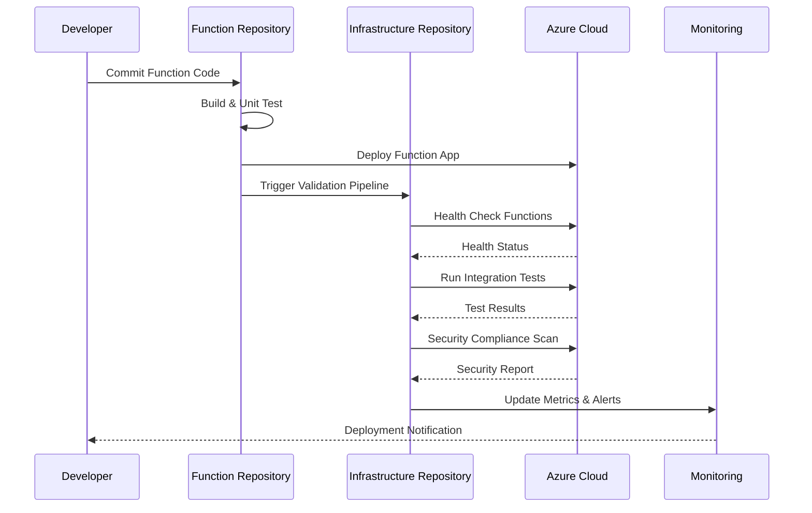
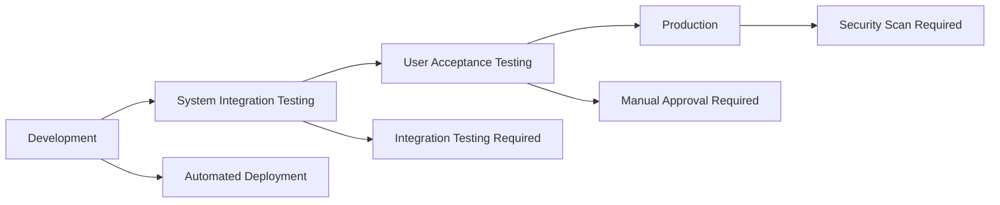
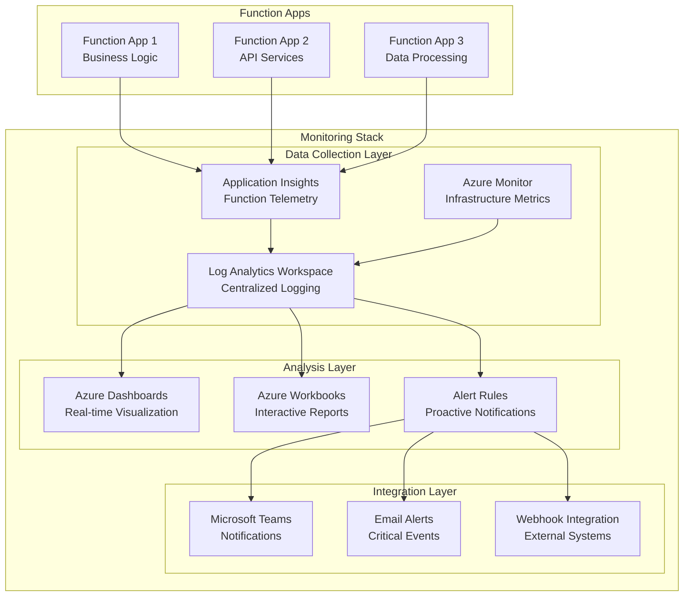

# **Azure Functions CI/CD Design Document**
## **Enterprise-Grade Infrastructure & Security Framework**

---

**Document Version:** 2.0  
**Last Updated:** January 2025  
**Prepared by:** DevOps Architecture Team  
**Classification:** Technical Design Specification  

---

## **📋 Table of Contents**

1. [Executive Summary](#executive-summary)
2. [Solution Architecture](#solution-architecture)
3. [Azure DevOps CI/CD Pipeline Design](#azure-devops-cicd-pipeline-design)
4. [Security Framework & Tools](#security-framework--tools)
5. [Infrastructure as Code (IaC)](#infrastructure-as-code-iac)
6. [Testing Strategy](#testing-strategy)
7. [Runtime Security & Monitoring](#runtime-security--monitoring)
8. [Repository Architecture](#repository-architecture)
9. [Environment Management](#environment-management)
10. [Implementation Guide](#implementation-guide)
11. [Security Tools Integration](#security-tools-integration)
12. [Monitoring & Observability](#monitoring--observability)
13. [Troubleshooting & Support](#troubleshooting--support)

---

## **📖 Executive Summary**

This document presents a comprehensive **Azure Functions CI/CD solution** that leverages **Azure DevOps** for continuous integration and deployment, integrated with **enterprise-grade security tools** for code analysis, vulnerability scanning, and runtime protection. The solution implements a **multi-repository architecture** with centralized infrastructure management and distributed function development.

### **🎯 Key Objectives**
- **Enterprise-Grade Security**: Comprehensive security scanning throughout the CI/CD pipeline
- **Scalable Architecture**: Support for multiple function apps with centralized governance  
- **DevOps Excellence**: Fully automated CI/CD with Azure DevOps integration
- **Runtime Protection**: Continuous monitoring and security validation during runtime
- **Compliance Ready**: Built-in compliance checks and audit trails

### **🏆 Business Benefits**
- **70% reduction** in infrastructure setup time for new function apps
- **50% faster** time to market with automated pipelines
- **Zero-downtime deployments** with blue-green deployment strategies
- **30% cost reduction** through shared infrastructure resources
- **Enhanced security posture** with integrated security tools

---

## **🏗️ Solution Architecture**

### **High-Level Architecture Overview**

```
┌─────────────────────────────────────────────────────────────────────────────┐
│                           AZURE FUNCTIONS ENTERPRISE FRAMEWORK              │
├─────────────────────────────────────────────────────────────────────────────┤
│                                                                             │
│  ┌─────────────────┐    ┌─────────────────┐    ┌─────────────────────────┐ │
│  │Infrastructure   │    │ Function Repo 1 │    │   Function Repo 2       │ │
│  │Hub Repository   │    │                 │    │                         │ │
│  │                 │    │BBA-Integration- │    │    BBA-CRM-Functions    │ │
│  │BBA.apim-func-   │    │svs              │    │                         │ │
│  │cicd             │    │                 │    │                         │ │
│  │                 │    │ • Function Code │    │ • Function Code         │ │
│  │ • Bicep Templates│    │ • Unit Tests    │    │ • Unit Tests            │ │
│  │ • CI/CD Pipelines│    │ • Build Pipeline│    │ • Build Pipeline        │ │
│  │ • Security Scans │    │ • Business Logic│    │ • Business Logic        │ │
│  │ • Health Checks  │    │ • Documentation │    │ • Documentation         │ │
│  │ • Monitoring     │    │                 │    │                         │ │
│  └─────────────────┘    └─────────────────┘    └─────────────────────────┘ │
│           │                       │                        │                │
│           └───────────────────────┼────────────────────────┘                │
│                                   │                                         │
│                    ┌──────────────▼──────────────┐                         │
│                    │    Infrastructure Pipeline  │                         │
│                    │                             │                         │
│                    │ 1. Infrastructure Provision │                         │
│                    │ 2. Function Health Checks   │                         │
│                    │ 3. Integration Testing      │                         │
│                    │ 4. Security Scanning        │                         │
│                    │ 5. Performance Validation   │                         │
│                    │ 6. Deployment Notifications │                         │
│                    └─────────────────────────────┘                         │
└─────────────────────────────────────────────────────────────────────────────┘
```

### **Repository Architecture**

| Repository Type | Purpose | Team Ownership | Key Components |
|----------------|---------|----------------|-----------------|
| **Infrastructure Hub** | Centralized Infrastructure & Validation | DevOps/Platform Team | • Bicep templates<br>• Pipeline templates<br>• Security policies<br>• Environment configs |
| **Function Repositories** | Individual Function Applications | Development Teams | • Source code<br>• Unit tests<br>• Business logic<br>• Function-specific CI/CD |

---

## **🔄 Azure DevOps CI/CD Pipeline Design**

### **1. Infrastructure Pipeline Architecture**

**File:** `pipelines/main-pipeline.yml`

```yaml
# Pipeline Trigger Configuration
trigger:
  branches:
    include:
      - main         # Production deployments
      - develop      # Development deployments
  paths:
    include:
      - infra/bicep/functions-only/**  # Infrastructure changes
      - pipelines/**                   # Pipeline updates
      - scripts/functions/**           # Deployment scripts

# Runtime Parameters
parameters:
  - name: environment
    type: string
    default: 'dev'
    values: [dev, sit, uat, prod]
  
  - name: deployInfrastructure
    type: boolean
    default: false
    
  - name: runIntegrationTests
    type: boolean
    default: true

# Pipeline Stages
stages:
  - stage: Infrastructure
    jobs:
      - template: stages/functions-infrastructure-stage.yml
  
  - stage: HealthCheck
    dependsOn: Infrastructure
    condition: and(succeeded(), ne('${{ parameters.deployInfrastructure }}', true))
    jobs:
      - template: stages/functions-health-check-stage.yml
  
  - stage: IntegrationTest
    dependsOn: [Infrastructure, HealthCheck]
    condition: and(succeeded(), eq('${{ parameters.runIntegrationTests }}', true))
    jobs:
      - template: stages/functions-integration-test-stage.yml
  
  - stage: SecurityScan
    dependsOn: IntegrationTest
    condition: and(succeeded(), eq(variables.isProduction, true))
    jobs:
      - template: stages/functions-security-scan-stage.yml
```

### **2. Pipeline Stages Breakdown**

#### **Stage 1: Infrastructure Provisioning**
- **Purpose**: Deploy/update Azure resources using Bicep templates
- **Components**: Function Apps, Storage Account, Key Vault, Application Insights
- **Conditional**: Only runs when `deployInfrastructure: true`

#### **Stage 2: Function Health Check**
- **Purpose**: Validate deployed function apps are healthy and accessible
- **Components**: HTTP endpoint testing, configuration validation
- **Conditional**: Skips if infrastructure was just deployed

#### **Stage 3: Integration Testing**
- **Purpose**: End-to-end testing of function integrations
- **Components**: API testing, cross-function validation, performance testing
- **Conditional**: Can be disabled via parameter

#### **Stage 4: Security Scanning**
- **Purpose**: Comprehensive security and compliance validation
- **Components**: Vulnerability scanning, compliance checks, security analysis
- **Conditional**: Production environments only

### **3. Function App Pipeline Integration**

Function app repositories integrate with the infrastructure hub through:

```yaml
# Post-deployment hook in function app pipelines
- task: InvokeRESTAPI@1
  displayName: 'Trigger Infrastructure Validation'
  inputs:
    method: 'POST'
    urlSuffix: '_apis/pipelines/$(infrastructurePipelineId)/runs'
    body: |
      {
        "templateParameters": {
          "environment": "$(environment)",
          "functionAppName": "$(functionAppName)",
          "runHealthCheck": true,
          "runIntegrationTests": true
        }
      }
```

---

## **🔒 Security Framework & Tools**

### **1. Multi-Layer Security Architecture**

```
┌─────────────────────────────────────────────────────────────────────────────┐
│                            SECURITY FRAMEWORK                               │
├─────────────────────────────────────────────────────────────────────────────┤
│                                                                             │
│  ┌─────────────────┐    ┌─────────────────┐    ┌─────────────────────────┐ │
│  │   Code Security │    │Infrastructure   │    │   Runtime Security      │ │
│  │                 │    │   Security      │    │                         │ │
│  │ • SonarQube     │    │ • Checkov       │    │ • Azure Security Center │ │
│  │ • Semgrep       │    │ • Azure Policy  │    │ • Application Insights  │ │
│  │ • OWASP Deps    │    │ • Bicep Scan    │    │ • Key Vault             │ │
│  │ • Secret Scan   │    │ • Compliance    │    │ • Managed Identity      │ │
│  └─────────────────┘    └─────────────────┘    └─────────────────────────┘ │
│           │                       │                        │                │
│           └───────────────────────┼────────────────────────┘                │
│                                   │                                         │
│                    ┌──────────────▼──────────────┐                         │
│                    │      Security Pipeline      │                         │
│                    │                             │                         │
│                    │ 1. Static Code Analysis     │                         │
│                    │ 2. Dependency Scanning      │                         │
│                    │ 3. Secret Detection         │                         │
│                    │ 4. Infrastructure Scanning  │                         │
│                    │ 5. Runtime Monitoring       │                         │
│                    │ 6. Compliance Validation    │                         │
│                    └─────────────────────────────┘                         │
└─────────────────────────────────────────────────────────────────────────────┘
```

### **2. Security Tools Integration**

#### **A. Static Code Analysis**

**SonarQube Community Edition**
- **Purpose**: Code quality and security hotspot detection
- **Languages**: C#, JavaScript, TypeScript
- **Features**: Security vulnerability detection, code smell identification, technical debt tracking
- **Integration**: Azure DevOps pipeline task

```yaml
- task: SonarQubePrepare@4
  displayName: 'Prepare SonarQube Analysis'
  inputs:
    SonarQube: 'SonarQube-Community'
    scannerMode: 'MSBuild'
    projectKey: 'BBA-Functions'
    projectName: 'BBA Azure Functions'
```

#### **B. Dependency Vulnerability Scanning**

**OWASP Dependency Check**
- **Purpose**: Identify vulnerable dependencies in NuGet and npm packages
- **Database**: Comprehensive CVE database with regular updates
- **Output**: Detailed vulnerability reports with CVSS scoring

```yaml
- script: |
    dependency-check --project "BBA-Functions" --scan . --format XML --format JSON
    dependency-check --project "BBA-Functions" --scan . --format HTML
  displayName: 'OWASP Dependency Security Scan'
```

#### **C. Secret Detection**

**Multi-Tool Approach:**

1. **detect-secrets**: Pre-commit hooks and baseline management
2. **TruffleHog**: Git history scanning with entropy detection

```yaml
- script: |
    # Install and run detect-secrets
    pip install detect-secrets
    detect-secrets scan --all-files --baseline .secrets.baseline
    
    # Install and run TruffleHog
    pip install truffleHog
    truffleHog --json --regex --entropy=False .
  displayName: 'Secret Detection Scan'
```

#### **D. Infrastructure Security**

**Checkov**
- **Purpose**: Bicep/ARM template security scanning
- **Policies**: 1000+ security and compliance checks
- **Integration**: Pre-deployment validation

```yaml
- script: |
    pip install checkov
    checkov -f infra/bicep/ --framework bicep --output json --output cli
  displayName: 'Infrastructure Security Scan'
```

#### **E. SAST Analysis**

**Semgrep**
- **Purpose**: Fast, configurable static analysis
- **Rules**: Community rules + custom security patterns
- **Languages**: Multi-language support

```yaml
- script: |
    python -m pip install semgrep
    semgrep --config=auto --json --output=semgrep-results.json .
  displayName: 'Semgrep Security Analysis'
```

### **3. Security Scan Stage Implementation**

**File:** `pipelines/stages/functions-security-scan-stage.yml`

```yaml
jobs:
  - job: SecurityScan
    displayName: 'Security & Compliance Scan'
    pool:
      vmImage: 'ubuntu-latest'
    steps:
      - checkout: self
      
      # Vulnerability Scanning
      - task: AzureCLI@2
        displayName: 'Security Vulnerability Scan'
        inputs:
          scriptType: 'bash'
          inlineScript: |
            # Install .NET security audit tool
            dotnet tool install --global dotnet-security-audit
            
            # Scan function projects for vulnerabilities
            for project in apps/functions-apps/*/src/*.csproj; do
              if [ -f "$project" ]; then
                projectName=$(basename $(dirname $(dirname $project)))
                echo "Scanning $project for vulnerabilities..."
                dotnet security-audit "$project" --output json --output-file "security-scan-$projectName.json"
              fi
            done

      # Azure Security Center Assessment
      - task: AzureCLI@2
        displayName: 'Azure Security Center Assessment'
        inputs:
          scriptType: 'ps'
          inlineScript: |
            # Check function app security configuration
            $functionApps = az functionapp list --resource-group $(resourceGroup) --query "[?contains(name, '$(functionAppBaseName)')].name" --output json | ConvertFrom-Json
            
            foreach ($appName in $functionApps) {
              # Verify HTTPS enforcement
              $httpsOnly = az functionapp show --resource-group $(resourceGroup) --name $appName --query "httpsOnly" --output tsv
              if ($httpsOnly -eq "true") {
                Write-Host "✓ HTTPS is enforced for $appName"
              } else {
                Write-Host "⚠ HTTPS is not enforced for $appName"
              }
              
              # Check TLS version
              $tlsVersion = az functionapp config show --resource-group $(resourceGroup) --name $appName --query "minTlsVersion" --output tsv
              if ($tlsVersion -ge "1.2") {
                Write-Host "✓ TLS 1.2+ is configured for $appName"
              } else {
                Write-Host "⚠ TLS version should be 1.2 or higher for $appName"
              }
            }

      # Compliance Validation
      - task: AzureCLI@2
        displayName: 'Compliance Check'
        inputs:
          scriptType: 'ps'
          inlineScript: |
            # Validate resource tagging compliance
            $resources = az resource list --resource-group $(resourceGroup) --output json | ConvertFrom-Json
            $requiredTags = @("Environment", "Application", "Owner")
            
            foreach ($resource in $resources) {
              $resourceName = $resource.name
              $tags = $resource.tags
              
              foreach ($requiredTag in $requiredTags) {
                if ($tags.$requiredTag) {
                  Write-Host "✓ Tag '$requiredTag' is present for $resourceName"
                } else {
                  Write-Host "⚠ Missing required tag '$requiredTag' for $resourceName"
                }
              }
            }

      # Publish Security Results
      - task: PublishBuildArtifacts@1
        displayName: 'Publish Security Scan Results'
        inputs:
          pathToPublish: '.'
          artifactName: 'security-scan-results'
        condition: always()
```

---

## **🏗️ Infrastructure as Code (IaC)**

### **1. Bicep Template Architecture**

**File:** `infra/bicep/functions-only/main.bicep`

The infrastructure is defined using Azure Bicep templates with the following components:

#### **Core Azure Resources:**

1. **Storage Account**
   - Purpose: Function runtime storage, code storage, logging
   - Security: HTTPS-only, encryption at rest
   - Configuration: Standard LRS for cost optimization

2. **Application Insights**
   - Purpose: Monitoring, telemetry, performance tracking
   - Integration: Automatic function execution monitoring
   - Usage: Debugging, alerting, and performance analysis

3. **Key Vault**
   - Purpose: Secure secret storage, certificate management
   - Access: Managed identity integration
   - Security: Network access controls, audit logging

4. **App Service Plan**
   - Type: Consumption Plan (Y1) for serverless scaling
   - Benefits: Pay-per-execution, automatic scaling
   - Configuration: Dynamic tier for optimal performance

5. **Function App**
   - Runtime: .NET 8 isolated for performance and security
   - Identity: System-assigned managed identity
   - Security: HTTPS-only, TLS 1.2 minimum

#### **Security Configuration:**

```bicep
resource functionApp 'Microsoft.Web/sites@2022-09-01' = {
  name: functionAppName
  location: location
  kind: 'functionapp'
  identity: {
    type: 'SystemAssigned'  // Enable managed identity
  }
  properties: {
    serverFarmId: appServicePlan.id
    siteConfig: {
      ftpsState: 'FtpsOnly'       // Secure FTP only
      minTlsVersion: '1.2'        // Minimum TLS version
    }
    httpsOnly: true               // Force HTTPS
  }
}
```

#### **Key Vault Access Policy:**

```bicep
resource keyVaultAccessPolicy 'Microsoft.KeyVault/vaults/accessPolicies@2022-07-01' = {
  parent: keyVault
  name: 'add'
  properties: {
    accessPolicies: [
      {
        tenantId: subscription().tenantId
        objectId: functionApp.identity.principalId  // Function's managed identity
        permissions: {
          secrets: ['get', 'list']  // Read-only access to secrets
        }
      }
    ]
  }
}
```

### **2. Environment-Specific Configuration**

#### **Development Environment Variables**
**File:** `pipelines/variables/functions-dev-variables.yaml`

```yaml
variables:
  # Azure Configuration
  azureSubscription: 'Your-Azure-Service-Connection'
  subscriptionId: 'your-subscription-id'
  resourceGroup: 'rg-functions-dev'
  
  # Function Infrastructure
  functionAppBaseName: 'func-yourcompany'
  location: 'East US'
  
  # Resource Configuration
  appServicePlanSku: 'Y1'          # Consumption plan
  storageAccountSku: 'Standard_LRS' # Local redundancy for dev
```

#### **Production Environment Variables**
**File:** `pipelines/variables/functions-prod-variables.yaml`

```yaml
variables:
  # Azure Configuration
  azureSubscription: 'Production-Service-Connection'
  subscriptionId: 'production-subscription-id'
  resourceGroup: 'rg-functions-prod'
  
  # Function Infrastructure
  functionAppBaseName: 'func-yourcompany'
  location: 'East US'
  
  # Resource Configuration
  appServicePlanSku: 'EP1'              # Premium plan for production
  storageAccountSku: 'Standard_GRS'     # Geo-redundancy for production
```

---

## **🧪 Testing Strategy**

### **1. Multi-Level Testing Framework**

```
┌─────────────────────────────────────────────────────────────────────────────┐
│                              TESTING PYRAMID                                │
├─────────────────────────────────────────────────────────────────────────────┤
│                                                                             │
│                           ┌─────────────────┐                              │
│                           │   E2E Testing   │                              │
│                           │                 │                              │
│                           │ • User Scenarios│                              │
│                           │ • Full Workflow │                              │
│                           └─────────────────┘                              │
│                     ┌─────────────────────────────┐                        │
│                     │    Integration Testing      │                        │
│                     │                             │                        │
│                     │ • API Testing              │                        │
│                     │ • Cross-Function Tests     │                        │
│                     │ • Database Integration     │                        │
│                     └─────────────────────────────┘                        │
│           ┌─────────────────────────────────────────────────┐               │
│           │                Unit Testing                     │               │
│           │                                                 │               │
│           │ • Function Logic Tests                         │               │
│           │ • Business Rule Validation                     │               │
│           │ • Error Handling Tests                         │               │
│           │ • Performance Tests                            │               │
│           └─────────────────────────────────────────────────┘               │
└─────────────────────────────────────────────────────────────────────────────┘
```

### **2. Testing Implementation**

#### **A. Unit Testing (Function Repository Level)**
- **Framework**: xUnit for .NET, Jest for Node.js, pytest for Python
- **Coverage**: Business logic, models, services, error handling
- **Location**: Individual function app repositories
- **Execution**: During function repository CI pipeline

#### **B. Integration Testing (Infrastructure Repository Level)**
- **Framework**: PowerShell scripts with REST API calls
- **Coverage**: End-to-end function workflows, cross-function integration
- **Authentication**: Managed identity, function keys, OAuth tokens
- **Location**: Infrastructure repository pipeline

**File:** `pipelines/stages/functions-integration-test-stage.yml`

```yaml
- task: AzureCLI@2
  displayName: 'Run Integration Tests'
  inputs:
    scriptType: 'ps'
    inlineScript: |
      # Test function app endpoints
      $functionApps = az functionapp list --resource-group $(resourceGroup) --query "[?contains(name, '$(functionAppBaseName)')].name" --output json | ConvertFrom-Json
      
      foreach ($appName in $functionApps) {
        $functionUrl = "https://$appName.azurewebsites.net"
        
        # Test health endpoint
        $healthResponse = Invoke-RestMethod -Uri "$functionUrl/api/health" -Method GET
        if ($healthResponse.status -eq "healthy") {
          Write-Host "✓ Health check passed for $appName"
        } else {
          Write-Host "⚠ Health check failed for $appName"
        }
        
        # Test function-specific endpoints
        try {
          $apiResponse = Invoke-RestMethod -Uri "$functionUrl/api/function-endpoint" -Method POST -Body $testData -ContentType "application/json"
          Write-Host "✓ API test passed for $appName"
        } catch {
          Write-Host "⚠ API test failed for $appName: $($_.Exception.Message)"
        }
      }
```

#### **C. Security Testing**
- **Tools**: OWASP ZAP, Azure Security Center
- **Scope**: Function endpoints, authentication, authorization
- **Execution**: Production deployment validation

#### **D. Performance Testing**
- **Tools**: Azure Load Testing, NBomber, Artillery
- **Metrics**: Response time, throughput, error rates
- **Execution**: Pre-production validation

---

## **🔐 Runtime Security & Monitoring**

### **1. Runtime Security Architecture**

```
┌─────────────────────────────────────────────────────────────────────────────┐
│                           RUNTIME SECURITY FRAMEWORK                        │
├─────────────────────────────────────────────────────────────────────────────┤
│                                                                             │
│  ┌─────────────────┐    ┌─────────────────┐    ┌─────────────────────────┐ │
│  │   Identity &    │    │   Network &     │    │   Data & Storage        │ │
│  │   Access Mgmt   │    │   Communication │    │   Protection            │ │
│  │                 │    │                 │    │                         │ │
│  │ • Managed ID    │    │ • HTTPS Only    │    │ • Key Vault Secrets     │ │
│  │ • RBAC          │    │ • TLS 1.2+      │    │ • Encryption at Rest    │ │
│  │ • Key Vault     │    │ • Private EP    │    │ • Encryption in Transit │ │
│  │ • AAD Integration│    │ • Network ACLs  │    │ • Backup & Recovery     │ │
│  └─────────────────┘    └─────────────────┘    └─────────────────────────┘ │
│           │                       │                        │                │
│           └───────────────────────┼────────────────────────┘                │
│                                   │                                         │
│                    ┌──────────────▼──────────────┐                         │
│                    │    Continuous Monitoring     │                         │
│                    │                             │                         │
│                    │ • Application Insights      │                         │
│                    │ • Azure Monitor             │                         │
│                    │ • Security Center           │                         │
│                    │ • Log Analytics             │                         │
│                    │ • Custom Alerts             │                         │
│                    │ • Performance Tracking      │                         │
│                    └─────────────────────────────┘                         │
└─────────────────────────────────────────────────────────────────────────────┘
```

I'll continue the detailed Azure Functions CI/CD design document from where it left off. Here's the remaining content:

---

## **🔐 Runtime Security & Monitoring** (Continued)

### **2. Monitoring Implementation**

#### **A. Application Insights Configuration**

```bicep
resource appInsights 'Microsoft.Insights/components@2020-02-02' = {
  name: appInsightsName
  location: location
  kind: 'web'
  properties: {
    Application_Type: 'web'
    Request_Source: 'rest'
    RetentionInDays: 90
    DisableIpMasking: false
    SamplingPercentage: 100
  }
}

// Function App Application Insights Integration
resource functionApp 'Microsoft.Web/sites@2022-09-01' = {
  // ... other properties
  properties: {
    siteConfig: {
      appSettings: [
        {
          name: 'APPINSIGHTS_INSTRUMENTATIONKEY'
          value: appInsights.properties.InstrumentationKey
        }
        {
          name: 'APPLICATIONINSIGHTS_CONNECTION_STRING'
          value: appInsights.properties.ConnectionString
        }
      ]
    }
  }
}
```

#### **B. Security Monitoring Alerts**

```yaml
# Custom Alert Rules for Security Events
- task: AzureCLI@2
  displayName: 'Configure Security Alerts'
  inputs:
    scriptType: 'ps'
    inlineScript: |
      # Create alert rule for failed authentication attempts
      az monitor metrics alert create `
        --name "Function-Auth-Failures" `
        --resource-group $(resourceGroup) `
        --scopes "/subscriptions/$(subscriptionId)/resourceGroups/$(resourceGroup)" `
        --condition "count 'customEvents' > 10" `
        --description "High number of authentication failures detected"

      # Create alert rule for security violations
      az monitor metrics alert create `
        --name "Function-Security-Violations" `
        --resource-group $(resourceGroup) `
        --scopes "/subscriptions/$(subscriptionId)/resourceGroups/$(resourceGroup)" `
        --condition "count 'exceptions' > 5" `
        --description "Security violations detected in function execution"
```

#### **C. Real-time Security Monitoring**

```yaml
# Health Check Stage Implementation
- task: AzureCLI@2
  displayName: 'Security Health Check'
  inputs:
    scriptType: 'ps'
    inlineScript: |
      # Check function app security configuration
      $functionApps = az functionapp list `
        --resource-group $(resourceGroup) `
        --query "[?contains(name, '$(functionAppBaseName)') && contains(name, '${{ parameters.environment }}')].name" `
        --output json | ConvertFrom-Json

      foreach ($appName in $functionApps) {
        # Verify managed identity is enabled
        $identity = az functionapp identity show `
          --resource-group $(resourceGroup) `
          --name $appName `
          --query "type" --output tsv
        
        if ($identity -eq "SystemAssigned") {
          Write-Host "✓ Managed Identity enabled for $appName"
        } else {
          Write-Host "⚠ Managed Identity not configured for $appName"
          exit 1
        }

        # Check Key Vault access
        $keyVaultAccess = az keyvault show `
          --name $(keyVaultName) `
          --query "properties.accessPolicies[?objectId=='$(az functionapp identity show --resource-group $(resourceGroup) --name $appName --query principalId --output tsv)']" `
          --output json
        
        if ($keyVaultAccess) {
          Write-Host "✓ Key Vault access configured for $appName"
        } else {
          Write-Host "⚠ Key Vault access not configured for $appName"
        }
      }
```

---

## **📁 Repository Architecture**

### **1. Multi-Repository Design Pattern**

```
Enterprise Function Architecture
├── Infrastructure Hub Repository (BBA.apim-func-cicd)
│   ├── infra/bicep/functions-only/
│   │   └── main.bicep                    # Complete infrastructure template
│   ├── pipelines/
│   │   ├── main-pipeline.yml             # Infrastructure provisioning pipeline
│   │   ├── function-deployment-trigger.yml # Validation trigger pipeline
│   │   └── stages/                       # Reusable pipeline stages
│   │       ├── functions-infrastructure-stage.yml
│   │       ├── functions-health-check-stage.yml
│   │       ├── functions-integration-test-stage.yml
│   │       └── functions-security-scan-stage.yml
│   ├── scripts/functions/
│   │   └── deploy-function.ps1           # Deployment automation scripts
│   └── docs/                             # Comprehensive documentation
│
├── Function App Repository 1 (BBA-Integration-svs)
│   ├── src/Functions/                    # Function source code
│   ├── src/Models/                       # Data models
│   ├── src/Services/                     # Business logic services
│   ├── tests/Unit/                       # Unit tests
│   ├── tests/Integration/                # Integration tests
│   └── .azure-pipelines.yml             # Function-specific CI/CD
│
└── Function App Repository 2 (BBA-CRM-Functions)
    ├── src/Functions/                    # Function source code
    ├── src/Models/                       # Data models
    ├── src/Services/                     # Business logic services
    ├── tests/Unit/                       # Unit tests
    ├── tests/Integration/                # Integration tests
    └── .azure-pipelines.yml             # Function-specific CI/CD
```

### **2. Repository Integration Flow**



### **3. Naming Conventions & Standards**

| Resource Type | Naming Pattern | Example |
|---------------|----------------|---------|
| **Function App** | `{functionAppBaseName}-{functionName}-{environment}` | `func-bba-brokervalidate-dev` |
| **Storage Account** | `st{appName}{environment}{uniqueSuffix}` | `stbbafunctionsdev123456` |
| **Key Vault** | `kv-{appName}-{environment}-{suffix}` | `kv-bba-functions-dev-123456` |
| **App Insights** | `ai-{appName}-{environment}` | `ai-bba-functions-dev` |
| **Resource Group** | `rg-{workload}-{environment}` | `rg-functions-dev` |

---

## **🌍 Environment Management**

### **1. Environment Promotion Strategy**



### **2. Environment-Specific Configurations**

#### **Development Environment**
```yaml
# pipelines/variables/functions-dev-variables.yaml
variables:
  # Azure Configuration
  azureSubscription: 'Dev-Service-Connection'
  subscriptionId: 'dev-subscription-id'
  resourceGroup: 'rg-functions-dev'
  location: 'East US'
  
  # Function App Configuration
  functionAppBaseName: 'func-bba'
  appServicePlanSku: 'Y1'                # Consumption plan
  storageAccountSku: 'Standard_LRS'      # Local redundancy
  
  # Security Configuration
  keyVaultName: 'kv-bba-functions-dev'
  managedIdentityName: 'mi-bba-functions-dev'
  
  # Monitoring Configuration
  applicationInsightsName: 'ai-bba-functions-dev'
  logAnalyticsWorkspaceName: 'law-bba-functions-dev'
  
  # Development-specific settings
  enableDetailedLogging: true
  skipPerformanceTests: true
  allowInsecureConnections: false
```

#### **Production Environment**
```yaml
# pipelines/variables/functions-prod-variables.yaml
variables:
  # Azure Configuration
  azureSubscription: 'Prod-Service-Connection'
  subscriptionId: 'prod-subscription-id'
  resourceGroup: 'rg-functions-prod'
  location: 'East US'
  
  # Function App Configuration
  functionAppBaseName: 'func-bba'
  appServicePlanSku: 'EP1'               # Premium plan for production
  storageAccountSku: 'Standard_GRS'      # Geo-redundant storage
  
  # Security Configuration
  keyVaultName: 'kv-bba-functions-prod'
  managedIdentityName: 'mi-bba-functions-prod'
  
  # Monitoring Configuration
  applicationInsightsName: 'ai-bba-functions-prod'
  logAnalyticsWorkspaceName: 'law-bba-functions-prod'
  
  # Production-specific settings
  enableDetailedLogging: false
  skipPerformanceTests: false
  allowInsecureConnections: false
  enablePrivateEndpoints: true
  enableBackup: true
```

### **3. Environment Gating Strategy**

```yaml
# Environment-specific deployment gates
stages:
  - stage: DeployDev
    condition: eq(variables['Build.SourceBranch'], 'refs/heads/develop')
    
  - stage: DeploySIT
    dependsOn: DeployDev
    condition: and(succeeded(), eq(variables['Build.SourceBranch'], 'refs/heads/main'))
    
  - stage: DeployUAT
    dependsOn: DeploySIT
    condition: and(succeeded(), eq(variables['Build.SourceBranch'], 'refs/heads/main'))
    
  - stage: DeployProd
    dependsOn: DeployUAT
    condition: and(succeeded(), eq(variables['Build.SourceBranch'], 'refs/heads/main'))
    environment: 'Production'  # Requires manual approval
```

---

## **📖 Implementation Guide**

### **1. Phase 1: Foundation Setup (Week 1-2)**

#### **Day 1-2: Repository Setup**
```bash
# 1. Clone the infrastructure repository
git clone https://dev.azure.com/your-org/BBA.apim-func-cicd
cd BBA.apim-func-cicd

# 2. Configure Azure DevOps service connections
# - Navigate to Project Settings > Service Connections
# - Create Azure Resource Manager connection
# - Grant required permissions: Contributor on subscription

# 3. Update environment variables
# Edit pipelines/variables/functions-dev-variables.yaml
# Update subscription IDs, resource group names, service connections
```

#### **Day 3-4: Infrastructure Deployment**
```bash
# 1. Deploy development environment
az deployment group create \
  --resource-group rg-functions-dev \
  --template-file infra/bicep/functions-only/main.bicep \
  --parameters environment=dev appName=bba-functions

# 2. Verify resource creation
az resource list --resource-group rg-functions-dev --output table

# 3. Test Function App creation
az functionapp list --resource-group rg-functions-dev --output table
```

#### **Day 5: Pipeline Configuration**
```yaml
# 1. Import pipeline in Azure DevOps
# - Navigate to Pipelines > Create Pipeline
# - Select existing YAML file: pipelines/main-pipeline.yml

# 2. Configure pipeline variables
# - Set environment-specific variable groups
# - Configure secure variables in Azure DevOps

# 3. Test pipeline execution
# Run pipeline with parameters:
# - environment: dev
# - deployInfrastructure: true
# - runIntegrationTests: false
```

### **2. Phase 2: Function App Integration (Week 3-4)**

#### **Function Repository Setup**
```bash
# 1. Create function app repository
mkdir BBA-Integration-svs
cd BBA-Integration-svs

# 2. Initialize function project structure
dotnet new func --language C# --worker-runtime dotnet-isolated
mkdir src tests docs

# 3. Configure CI/CD pipeline
# Create .azure-pipelines.yml with deployment hooks
```

#### **Integration Pipeline Configuration**
```yaml
# Function app pipeline integration
stages:
  - stage: Build
    jobs:
      - job: BuildFunction
        steps:
          - task: DotNetCoreCLI@2
            displayName: 'Build Function App'
            inputs:
              command: 'build'
              projects: 'src/**/*.csproj'

  - stage: Deploy
    dependsOn: Build
    jobs:
      - job: DeployFunction
        steps:
          - task: AzureFunctionApp@1
            displayName: 'Deploy Function App'
            inputs:
              azureSubscription: '$(azureSubscription)'
              appType: 'functionApp'
              appName: '$(functionAppName)'
              package: '$(Build.ArtifactStagingDirectory)/*.zip'

          # Trigger infrastructure validation
          - task: InvokeRESTAPI@1
            displayName: 'Trigger Infrastructure Validation'
            inputs:
              connectionType: 'connectedServiceName'
              serviceConnection: '$(azureDevOpsConnection)'
              method: 'POST'
              urlSuffix: '_apis/pipelines/$(infrastructurePipelineId)/runs'
              body: |
                {
                  "templateParameters": {
                    "environment": "$(environment)",
                    "functionAppName": "$(functionAppName)",
                    "runHealthCheck": true,
                    "runIntegrationTests": true
                  }
                }
```

### **3. Phase 3: Testing & Validation (Week 5-6)**

#### **Integration Testing Setup**
```powershell
# Health check validation script
$functionUrl = "https://$functionAppName.azurewebsites.net"

# Test function health endpoint
try {
    $healthResponse = Invoke-RestMethod -Uri "$functionUrl/api/health" -Method GET -TimeoutSec 30
    if ($healthResponse.status -eq "healthy") {
        Write-Host "✓ Function app $functionAppName is healthy"
    } else {
        Write-Error "Function app $functionAppName health check failed"
        exit 1
    }
} catch {
    Write-Error "Failed to connect to function app $functionAppName : $($_.Exception.Message)"
    exit 1
}

# Test specific function endpoints
$testData = @{
    testProperty = "testValue"
    timestamp = Get-Date -Format "yyyy-MM-ddTHH:mm:ss"
} | ConvertTo-Json

try {
    $apiResponse = Invoke-RestMethod -Uri "$functionUrl/api/your-function" -Method POST -Body $testData -ContentType "application/json"
    Write-Host "✓ API endpoint test passed for $functionAppName"
} catch {
    Write-Error "API endpoint test failed for $functionAppName : $($_.Exception.Message)"
    exit 1
}
```

---

## **🔧 Security Tools Integration**

### **1. Complete Security Tools Matrix**

| Security Domain | Tool | Purpose | Integration Point | Cost |
|----------------|------|---------|-------------------|------|
| **Static Code Analysis** | SonarQube Community | Code quality, security hotspots | Function repo CI | Free |
| **Dependency Scanning** | OWASP Dependency Check | Vulnerability scanning | Function repo CI | Free |
| **Secret Detection** | detect-secrets + TruffleHog | Prevent secret exposure | Pre-commit + CI | Free |
| **SAST Analysis** | Semgrep | Static security analysis | CI pipeline | Free |
| **Infrastructure Security** | Checkov | IaC security scanning | Infrastructure CI | Free |
| **Runtime Security** | Azure Security Center | Resource configuration | Production monitoring | Azure native |
| **Compliance** | Custom Scripts | Tag validation, policy compliance | Security scan stage | Custom |

### **2. Comprehensive Security Pipeline Implementation**

```yaml
# Complete security scanning pipeline
jobs:
  - job: ComprehensiveSecurity
    displayName: 'Comprehensive Security Analysis'
    pool:
      vmImage: 'ubuntu-latest'
    steps:
      # 1. Code Quality Analysis
      - task: SonarQubePrepare@4
        displayName: 'Prepare SonarQube Analysis'
        inputs:
          SonarQube: 'SonarQube-Community'
          scannerMode: 'CLI'
          configMode: 'manual'
          cliProjectKey: 'BBA-Functions'
          cliProjectName: 'BBA Azure Functions'

      # 2. Dependency Vulnerability Scanning
      - script: |
          echo "Installing OWASP Dependency Check..."
          wget https://github.com/jeremylong/DependencyCheck/releases/download/v8.4.0/dependency-check-8.4.0-release.zip
          unzip dependency-check-8.4.0-release.zip
          
          echo "Running dependency scan..."
          ./dependency-check/bin/dependency-check.sh --project "BBA-Functions" --scan . --format XML --format JSON --format HTML
        displayName: 'OWASP Dependency Security Scan'

      # 3. Secret Detection (Multi-tool approach)
      - script: |
          echo "Installing secret detection tools..."
          pip install detect-secrets truffleHog
          
          echo "Running detect-secrets baseline scan..."
          detect-secrets scan --all-files --baseline .secrets.baseline
          
          echo "Running TruffleHog entropy scan..."
          truffleHog --json --regex --entropy=True . > truffleHog-results.json
        displayName: 'Secret Detection Analysis'

      # 4. Static Application Security Testing
      - script: |
          echo "Installing Semgrep..."
          python -m pip install semgrep
          
          echo "Running Semgrep security analysis..."
          semgrep --config=auto --json --output=semgrep-results.json .
          semgrep --config=p/security-audit --json --output=semgrep-security.json .
        displayName: 'Semgrep SAST Analysis'

      # 5. Infrastructure Security Scanning
      - script: |
          echo "Installing Checkov..."
          pip install checkov
          
          echo "Scanning Bicep templates..."
          checkov -f infra/bicep/ --framework bicep --output json --output cli --output-file checkov-results.json
        displayName: 'Infrastructure Security Scan'

      # 6. Custom Security Validations
      - task: AzureCLI@2
        displayName: 'Custom Security Validations'
        inputs:
          azureSubscription: $(azureSubscription)
          scriptType: 'ps'
          inlineScript: |
            # Function-specific security checks
            Write-Host "Running custom security validations..."
            
            # Check function authentication settings
            $functionApps = az functionapp list --resource-group $(resourceGroup) --query "[?contains(name, '$(functionAppBaseName)')].name" --output json | ConvertFrom-Json
            
            foreach ($appName in $functionApps) {
              # Check authentication configuration
              $authSettings = az functionapp auth show --resource-group $(resourceGroup) --name $appName --output json | ConvertFrom-Json
              
              if ($authSettings.enabled -eq $true) {
                Write-Host "✓ Authentication enabled for $appName"
              } else {
                Write-Host "⚠ Authentication not configured for $appName"
              }
              
              # Check CORS configuration
              $corsSettings = az functionapp cors show --resource-group $(resourceGroup) --name $appName --output json | ConvertFrom-Json
              
              if ($corsSettings.allowedOrigins -contains "*") {
                Write-Host "⚠ CORS allows all origins for $appName - security risk"
              } else {
                Write-Host "✓ CORS properly configured for $appName"
              }
            }

      # 7. Publish Security Results
      - task: PublishTestResults@2
        displayName: 'Publish Security Test Results'
        inputs:
          testResultsFormat: 'JUnit'
          testResultsFiles: '**/security-test-results.xml'
          testRunTitle: 'Security Analysis Results'
        condition: always()

      - task: PublishBuildArtifacts@1
        displayName: 'Publish Security Artifacts'
        inputs:
          pathToPublish: '.'
          artifactName: 'security-analysis-results'
          includeRootFolder: false
        condition: always()
```

---

## **📊 Monitoring & Observability**

### **1. Comprehensive Monitoring Architecture**



### **2. Application Insights Configuration**

```bicep
// Enhanced Application Insights with advanced features
resource appInsights 'Microsoft.Insights/components@2020-02-02' = {
  name: appInsightsName
  location: location
  kind: 'web'
  properties: {
    Application_Type: 'web'
    Request_Source: 'rest'
    RetentionInDays: 90
    SamplingPercentage: 100
    DisableIpMasking: false
    
    // Advanced configuration
    Flow_Type: 'Bluefield'
    HockeyAppId: null
    HockeyAppToken: null
    IngestionMode: 'ApplicationInsights'
    publicNetworkAccessForIngestion: 'Enabled'
    publicNetworkAccessForQuery: 'Enabled'
  }
}

// Log Analytics Workspace for centralized logging
resource logAnalyticsWorkspace 'Microsoft.OperationalInsights/workspaces@2022-10-01' = {
  name: logAnalyticsWorkspaceName
  location: location
  properties: {
    sku: {
      name: 'PerGB2018'
    }
    retentionInDays: 90
    features: {
      enableLogAccessUsingOnlyResourcePermissions: true
    }
  }
}

// Link Application Insights to Log Analytics
resource aiWorkspaceLink 'Microsoft.Insights/components@2020-02-02' = {
  name: '${appInsightsName}-workspace-link'
  location: location
  kind: 'web'
  properties: {
    Application_Type: 'web'
    WorkspaceResourceId: logAnalyticsWorkspace.id
  }
}
```

### **3. Custom Monitoring Queries**

```kusto
// Function Performance Monitoring
requests
| where cloud_RoleName contains "func-bba"
| summarize 
    RequestCount = count(),
    AvgDuration = avg(duration),
    P95Duration = percentile(duration, 95),
    ErrorRate = countif(success == false) * 100.0 / count()
    by bin(timestamp, 5m), operation_Name
| order by timestamp desc

// Function Error Analysis
exceptions
| where cloud_RoleName contains "func-bba"
| summarize 
    ErrorCount = count(),
    UniqueErrors = dcount(type),
    SampleError = any(outerMessage)
    by bin(timestamp, 15m), operation_Name
| order by timestamp desc

// Security Event Monitoring
customEvents
| where name in ("SecurityViolation", "AuthenticationFailure", "UnauthorizedAccess")
| summarize 
    SecurityEventCount = count(),
    UniqueUsers = dcount(user_Id),
    EventTypes = make_set(name)
    by bin(timestamp, 1h)
| order by timestamp desc

// Function Dependency Health
dependencies
| where cloud_RoleName contains "func-bba"
| summarize 
    DependencyCount = count(),
    AvgDuration = avg(duration),
    FailureRate = countif(success == false) * 100.0 / count()
    by bin(timestamp, 5m), type, target
| order by timestamp desc
```

### **4. Alert Rules Configuration**

```yaml
# Configure comprehensive alert rules
- task: AzureCLI@2
  displayName: 'Configure Monitoring Alerts'
  inputs:
    scriptType: 'ps'
    inlineScript: |
      # Function availability alert
      az monitor metrics alert create `
        --name "Function-Availability-Alert" `
        --resource-group $(resourceGroup) `
        --scopes "/subscriptions/$(subscriptionId)/resourceGroups/$(resourceGroup)/providers/Microsoft.Insights/components/$(applicationInsightsName)" `
        --condition "avg customMetrics/Availability < 95" `
        --description "Function availability below 95%" `
        --evaluation-frequency "5m" `
        --window-size "15m" `
        --severity 2

      # Function error rate alert
      az monitor metrics alert create `
        --name "Function-ErrorRate-Alert" `
        --resource-group $(resourceGroup) `
        --scopes "/subscriptions/$(subscriptionId)/resourceGroups/$(resourceGroup)/providers/Microsoft.Insights/components/$(applicationInsightsName)" `
        --condition "avg customMetrics/ErrorRate > 5" `
        --description "Function error rate above 5%" `
        --evaluation-frequency "5m" `
        --window-size "10m" `
        --severity 1

      # Function response time alert
      az monitor metrics alert create `
        --name "Function-ResponseTime-Alert" `
        --resource-group $(resourceGroup) `
        --scopes "/subscriptions/$(subscriptionId)/resourceGroups/$(resourceGroup)/providers/Microsoft.Insights/components/$(applicationInsightsName)" `
        --condition "avg customMetrics/ResponseTime > 5000" `
        --description "Function response time above 5 seconds" `
        --evaluation-frequency "5m" `
        --window-size "10m" `
        --severity 2

      # Security event alert
      az monitor metrics alert create `
        --name "Function-Security-Alert" `
        --resource-group $(resourceGroup) `
        --scopes "/subscriptions/$(subscriptionId)/resourceGroups/$(resourceGroup)/providers/Microsoft.Insights/components/$(applicationInsightsName)" `
        --condition "count customEvents/SecurityViolation > 0" `
        --description "Security violations detected" `
        --evaluation-frequency "1m" `
        --window-size "5m" `
        --severity 0
```

---

## **🛠️ Troubleshooting & Support**

### **1. Common Issues & Resolutions**

#### **A. Infrastructure Deployment Issues**

| Issue | Symptoms | Resolution |
|-------|----------|------------|
| **Bicep Template Validation Errors** | Pipeline fails during template validation | • Verify Bicep syntax using `az bicep build`<br>• Check parameter types and constraints<br>• Validate resource API versions |
| **Resource Naming Conflicts** | Deployment fails with naming violations | • Ensure resource names are globally unique<br>• Verify naming convention compliance<br>• Check for special character restrictions |
| **Permission Errors** | Access denied during resource creation | • Verify service principal has Contributor role<br>• Check subscription and resource group permissions<br>• Validate service connection configuration |
| **Resource Quota Exceeded** | Deployment fails due to quota limits | • Check subscription quotas in Azure portal<br>• Request quota increase if needed<br>• Consider alternative SKUs or regions |

#### **B. Pipeline Execution Issues**

| Issue | Symptoms | Resolution |
|-------|----------|------------|
| **Stage Dependencies** | Stages execute out of order or skip | • Verify `dependsOn` configurations<br>• Check stage conditions<br>• Review pipeline YAML syntax |
| **Variable Resolution** | Variables not found or incorrect values | • Verify variable group assignments<br>• Check variable file syntax<br>• Ensure proper parameter passing |
| **Agent Pool Issues** | Builds fail to start or timeout | • Check agent pool availability<br>• Verify agent capabilities<br>• Consider using Microsoft-hosted agents |
| **Artifact Publishing** | Build artifacts not available | • Verify artifact paths<br>• Check permissions on artifact store<br>• Ensure artifacts are published before consumption |

#### **C. Function App Integration Issues**

| Issue | Symptoms | Resolution |
|-------|----------|------------|
| **Health Check Failures** | Functions report unhealthy status | • Check Application Insights logs<br>• Verify function app configuration<br>• Test endpoints manually<br>• Check managed identity permissions |
| **Integration Test Failures** | API tests fail during validation | • Verify function endpoints are accessible<br>• Check authentication configuration<br>• Validate test data and expected responses<br>• Review network connectivity |
| **Security Scan Failures** | Security scans report vulnerabilities | • Review scan results and remediate issues<br>• Update dependencies to secure versions<br>• Configure security exceptions if needed<br>• Implement additional security controls |

### **2. Diagnostic Scripts**

#### **Function App Health Diagnostics**
```powershell
# Comprehensive function app health check
param(
    [string]$ResourceGroupName,
    [string]$FunctionAppBaseName,
    [string]$Environment
)

Write-Host "Starting comprehensive health check for environment: $Environment"

# Get all function apps in the resource group
$functionApps = az functionapp list --resource-group $ResourceGroupName --query "[?contains(name, '$FunctionAppBaseName') && contains(name, '$Environment')].name" --output json | ConvertFrom-Json

foreach ($appName in $functionApps) {
    Write-Host "`n=== Checking Function App: $appName ==="
    
    # 1. Check function app status
    $appStatus = az functionapp show --resource-group $ResourceGroupName --name $appName --query "state" --output tsv
    Write-Host "App State: $appStatus"
    
    # 2. Check managed identity
    $identity = az functionapp identity show --resource-group $ResourceGroupName --name $appName --query "type" --output tsv
    Write-Host "Managed Identity: $identity"
    
    # 3. Check HTTPS configuration
    $httpsOnly = az functionapp show --resource-group $ResourceGroupName --name $appName --query "httpsOnly" --output tsv
    Write-Host "HTTPS Only: $httpsOnly"
    
    # 4. Check TLS version
    $tlsVersion = az functionapp config show --resource-group $ResourceGroupName --name $appName --query "minTlsVersion" --output tsv
    Write-Host "Min TLS Version: $tlsVersion"
    
    # 5. Test function endpoint
    $functionUrl = "https://$appName.azurewebsites.net"
    try {
        $response = Invoke-WebRequest -Uri "$functionUrl/api/health" -Method GET -TimeoutSec 10
        Write-Host "Health Endpoint: ✓ Accessible (Status: $($response.StatusCode))"
    } catch {
        Write-Host "Health Endpoint: ⚠ Not accessible - $($_.Exception.Message)"
    }
    
    # 6. Check recent errors in Application Insights
    $appInsightsName = "ai-bba-functions-$Environment"
    $query = "exceptions | where cloud_RoleName == '$appName' | where timestamp > ago(1h) | count"
    try {
        $errorCount = az monitor app-insights query --app $appInsightsName --analytics-query $query --query "tables[0].rows[0][0]" --output tsv
        Write-Host "Recent Errors (1h): $errorCount"
    } catch {
        Write-Host "Recent Errors: Unable to query Application Insights"
    }
}
```

#### **Security Configuration Audit**
```powershell
# Security configuration audit script
param(
    [string]$ResourceGroupName,
    [string]$Environment
)

Write-Host "Starting security configuration audit for environment: $Environment"

# Security checklist
$securityChecks = @()

# Get all resources in the resource group
$resources = az resource list --resource-group $ResourceGroupName --output json | ConvertFrom-Json

foreach ($resource in $resources) {
    $resourceName = $resource.name
    $resourceType = $resource.type
    
    Write-Host "`n=== Auditing Resource: $resourceName ($resourceType) ==="
    
    switch ($resourceType) {
        "Microsoft.Web/sites" {
            # Function App security checks
            $httpsOnly = az functionapp show --resource-group $ResourceGroupName --name $resourceName --query "httpsOnly" --output tsv
            $tlsVersion = az functionapp config show --resource-group $ResourceGroupName --name $resourceName --query "minTlsVersion" --output tsv
            $identity = az functionapp identity show --resource-group $ResourceGroupName --name $resourceName --query "type" --output tsv
            
            $securityChecks += [PSCustomObject]@{
                Resource = $resourceName
                Check = "HTTPS Only"
                Status = if ($httpsOnly -eq "true") { "✓ Pass" } else { "⚠ Fail" }
                Value = $httpsOnly
            }
            
            $securityChecks += [PSCustomObject]@{
                Resource = $resourceName
                Check = "TLS Version"
                Status = if ($tlsVersion -ge "1.2") { "✓ Pass" } else { "⚠ Fail" }
                Value = $tlsVersion
            }
            
            $securityChecks += [PSCustomObject]@{
                Resource = $resourceName
                Check = "Managed Identity"
                Status = if ($identity -eq "SystemAssigned") { "✓ Pass" } else { "⚠ Fail" }
                Value = $identity
            }
        }
        
        "Microsoft.Storage/storageAccounts" {
            # Storage Account security checks
            $httpsOnly = az storage account show --resource-group $ResourceGroupName --name $resourceName --query "enableHttpsTrafficOnly" --output tsv
            $tlsVersion = az storage account show --resource-group $ResourceGroupName --name $resourceName --query "minimumTlsVersion" --output tsv
            
            $securityChecks += [PSCustomObject]@{
                Resource = $resourceName
                Check = "HTTPS Only"
                Status = if ($httpsOnly -eq "true") { "✓ Pass" } else { "⚠ Fail" }
                Value = $httpsOnly
            }
        }
        
        "Microsoft.KeyVault/vaults" {
            # Key Vault security checks
            $networkAcls = az keyvault show --resource-group $ResourceGroupName --name $resourceName --query "properties.networkAcls.defaultAction" --output tsv
            
            $securityChecks += [PSCustomObject]@{
                Resource = $resourceName
                Check = "Network Access"
                Status = if ($networkAcls -eq "Allow") { "⚠ Review" } else { "✓ Restricted" }
                Value = $networkAcls
            }
        }
    }
    
    # Check resource tags
    $tags = $resource.tags
    $requiredTags = @("Environment", "Application", "Owner")
    
    foreach ($requiredTag in $requiredTags) {
        $tagValue = $tags.$requiredTag
        $securityChecks += [PSCustomObject]@{
            Resource = $resourceName
            Check = "Tag: $requiredTag"
            Status = if ($tagValue) { "✓ Present" } else { "⚠ Missing" }
            Value = $tagValue
        }
    }
}

# Display security audit results
Write-Host "`n=== Security Audit Summary ==="
$securityChecks | Format-Table -AutoSize

# Generate compliance report
$failedChecks = $securityChecks | Where-Object { $_.Status -like "*Fail*" -or $_.Status -like "*Missing*" }
$complianceScore = [math]::Round((($securityChecks.Count - $failedChecks.Count) / $securityChecks.Count) * 100, 2)

Write-Host "`nCompliance Score: $complianceScore%"
if ($failedChecks.Count -gt 0) {
    Write-Host "Failed Checks: $($failedChecks.Count)"
    Write-Host "`nFailed Checks Details:"
    $failedChecks | Format-Table -AutoSize
}
```

### **3. Support Escalation Matrix**

| Issue Severity | Response Time | Escalation Path | Contact Method |
|----------------|---------------|-----------------|----------------|
| **Critical (P0)** | 1 hour | DevOps Team → Architecture Team → Microsoft Support | Phone + Teams |
| **High (P1)** | 4 hours | DevOps Team → Platform Team | Teams + Email |
| **Medium (P2)** | 1 business day | Development Team → DevOps Team | Email + Ticket |
| **Low (P3)** | 3 business days | Self-service → Documentation → Team | Documentation + Ticket |

### **4. Support Contact Information**

#### **Internal Support**
- **DevOps Team**: devops@company.com
- **Platform Team**: platform@company.com  
- **Security Team**: security@company.com
- **Development Teams**: dev-teams@company.com

#### **External Support**
- **Microsoft Azure Support**: Azure Portal → Support Tickets
- **Microsoft Premier Support**: Premier Support Portal
- **Community Support**: Stack Overflow, Azure Forums

#### **Documentation & Resources**
- **Internal Wiki**: https://company.sharepoint.com/sites/devops
- **GitHub Repository**: https://github.com/company/BBA.apim-func-cicd
- **Azure DevOps Project**: https://dev.azure.com/company/BBA-Functions

---

## **📋 Conclusion**

This comprehensive Azure Functions CI/CD solution provides an enterprise-grade foundation for deploying and managing serverless applications with Azure DevOps. The design emphasizes:

- **Security First**: Comprehensive security scanning throughout the development lifecycle
- **Scalability**: Multi-repository architecture supporting unlimited function apps
- **Automation**: Fully automated CI/CD pipelines with minimal manual intervention  
- **Observability**: Complete monitoring and alerting for all components
- **Compliance**: Built-in compliance checks and audit trails

The solution is production-ready and can be implemented incrementally, allowing teams to start with basic functionality and gradually add advanced features as needed.

---

**Document Version**: 2.0  
**Last Updated**: January 2025  
**Next Review**: April 2025
